<div align="center">

# 🛍️ E-Commerce User Analysis

### *Turn two years of retail transactions into inspectable customer segments, cluster cross-checks, and strategy hypotheses.*

[](#analysis-tracks)
[](#reproduce)
[](https://archive.ics.uci.edu/dataset/502/online+retail+ii)
[](#methodology)
[](https://github.com/okht/ecommerce-user-analysis)

[](#dashboard)
[](#snapshot)
[](#generated-files)
[](#data-and-citation)

<br>

<table>
<tr><td align="left">

🧹 &nbsp;1,067,371 transactions contain missing IDs, cancellations, and nonpositive values.<br>
📊 &nbsp;Median customer spend is £899 while the mean reaches £3,019.<br>
🔍 &nbsp;Rule-based RFM groups can hide extreme and wholesale-like customer behavior.

</td></tr>
</table>

### ✨ Turn raw transactions into traceable segment evidence without hiding cleaning decisions or model limits.

**UCI workbook → cleaning → EDA + RFM → K-Means cross-check → CSV artifacts + dashboard views**

<br>

[📚 Snapshot](#snapshot) · [🔬 Analysis](#analysis-tracks) · [📈 Results](#recorded-results) · [🗺️ Workflow](#workflow) · [🚀 Reproduce](#reproduce) · [🛡️ Data](#data-and-citation) · [🧪 Verification](#verification) · [📁 Structure](#project-structure) · [📌 Limitations](#limitations)

[**English**](README.md) · [**简体中文**](README_CN.md) · [**Español**](README_ES.md) · [**Deutsch**](README_DE.md) · [**日本語**](README_JA.md) · [**Русский**](README_RU.md) · [**Português**](README_PT.md) · [**한국어**](README_KO.md)

</div>

---

<a id="snapshot"></a>

## 📚 Snapshot

The committed notebooks analyze the UCI Online Retail II workbook and retain their recorded outputs for inspection.

| Measure | Recorded value | Evidence boundary |
|---|---:|---|
| **Raw transactions** | 1,067,371 rows · 8 fields | Two workbook sheets |
| **Cleaned transactions** | 805,549 rows | Missing customer IDs, cancellations, and nonpositive values removed |
| **Time window** | 2009-12-01 → 2011-12-09 | Historical retail data |
| **Entities** | 5,878 customers · 36,969 orders · 4,631 products · 41 countries | Derived from the cleaned snapshot |
| **Recorded revenue** | £17,743,429 | `Quantity × Price` after cleaning |

---

<a id="analysis-tracks"></a>

## 🔬 Analysis tracks

| Notebook | Track | Recorded artifact |
|---|---|---|
| **`01_data_cleaning.ipynb`** | Loads both sheets, audits quality, and applies cleaning rules | `retail_cleaned.csv` |
| **`02_eda.ipynb.ipynb`** | Explores time, geography, products, and customer distributions | Saved tables and figures |
| **`03_rfm_analysis.ipynb.ipynb`** | Scores Recency, Frequency, and Monetary value into eight rule-based groups | `rfm_result.csv` |
| **`04_clustering.ipynb.ipynb`** | Standardizes R/F/M, fits K-Means, and compares clusters with RFM groups | `rfm_clustered.csv` |
| **`05_insights.ipynb.ipynb`** | Summarizes segments and writes recommendations and experiment hypotheses | Saved strategy tables and figures |

---

<a id="recorded-results"></a>

## 📈 Recorded results

These values come from outputs stored inside the committed notebooks. They have not been rerun from the unbundled source workbook during this README update.

| Area | Recorded result | Interpretation boundary |
|---|---|---|
| **Data quality** | 243,007 missing customer IDs · 19,494 cancellation rows | Issue counts overlap |
| **Cleaning** | 805,549 of 1,067,371 rows retained | About 75.5% of the source rows |
| **Market** | United Kingdom contributes 83.0% of recorded revenue | Descriptive result for this historical dataset |
| **Products** | Top 20% contribute about 78.4% of revenue | Concentration within the cleaned snapshot |
| **Customers** | Median spend £898.9 · mean £3,018.6 · maximum £608,821.6 | Strongly skewed distribution |
| **RFM concentration** | 1,300 loyal high-value customers contribute 68.4% of revenue | 22.1% of the 5,878 customers |
| **Cluster cross-check** | 1,326 of 1,523 RFM dormant customers enter the dormant low-value cluster | 87.1% overlap; no causal validation |

---

<a id="customer-segments"></a>

## 🏷️ Customer segments

| RFM segment | Customers | Revenue share | Recorded recommendation |
|---|---:|---:|---|
| **Loyal high-value** | 1,300 | 68.4% | Protect retention and test VIP treatment |
| **High potential** | 975 | 13.8% | Test milestones and category expansion |
| **At-risk high-value** | 227 | 5.7% | Prioritize win-back experiments |
| **Regular** | 1,102 | 4.6% | Maintain standard engagement |
| **Dormant** | 1,523 | 3.8% | Use low-cost, limited reactivation tests |
| **New** | 443 | 2.2% | Test onboarding and second-order nudges |
| **Frequent low-spend** | 182 | 0.9% | Explore cross-sell and order-value uplift |
| **At-risk regular** | 126 | 0.6% | Monitor with low operational priority |

Recommendations are hypotheses derived from descriptive segmentation. The repository contains no completed intervention or A/B-test results.

---

<a id="workflow"></a>

## 🗺️ Workflow

```mermaid
flowchart LR
    N["Data not bundled"] -. prerequisite .-> A([UCI workbook])

    A --> B["Clean records"] --> C["retail_cleaned.csv"]
    C --> D["EDA findings"] --> L([Recorded evidence])
    C --> E["RFM · 8 segments"] --> F["rfm_result.csv"] --> L
    F --> G["K-Means · 5 clusters"] --> H["rfm_clustered.csv"] --> L
    H --> I["Strategy hypotheses"] --> L

    style N fill:#FEF2F2,stroke:#EF4444,stroke-width:1px,color:#000,font-size:12px
    style A fill:#FEF3C7,stroke:#F59E0B,stroke-width:2px,color:#000,font-size:12px
    style B fill:#DBEAFE,stroke:#3B82F6,stroke-width:2px,color:#000,font-size:12px
    style C fill:#EDE9FE,stroke:#8B5CF6,stroke-width:2px,color:#000,font-size:12px
    style D fill:#DBEAFE,stroke:#3B82F6,stroke-width:1px,color:#000,font-size:12px
    style E fill:#DBEAFE,stroke:#3B82F6,stroke-width:1px,color:#000,font-size:12px
    style F fill:#EDE9FE,stroke:#8B5CF6,stroke-width:1px,color:#000,font-size:12px
    style G fill:#DBEAFE,stroke:#3B82F6,stroke-width:1px,color:#000,font-size:12px
    style H fill:#EDE9FE,stroke:#8B5CF6,stroke-width:1px,color:#000,font-size:12px
    style I fill:#F1F5F9,stroke:#64748B,stroke-width:1px,color:#000,font-size:12px
    style L fill:#DCFCE7,stroke:#22C55E,stroke-width:2px,color:#000,font-size:12px
```



---

<a id="methodology"></a>

## ⚙️ Methodology

| Stage | Implemented method | Boundary |
|---|---|---|
| **Cleaning** | Drops missing `Customer ID`, cancellation invoices, and nonpositive quantity or price; derives `Revenue` | Returns and invalid rows are excluded from purchasing behavior |
| **EDA** | Aggregates monthly, country, product, and customer measures | Descriptive analysis only |
| **RFM** | Uses snapshot date 2011-12-10 and quintile scores; frequency ties use `rank(method="first")` | Eight segments are hand-written business rules |
| **K-Means** | Standardizes R/F/M, evaluates K=2–10 by elbow shape, then fits K=5 with `random_state=42` | K is heuristic; no silhouette or stability study is included |
| **Cross-check** | Uses a crosstab and PCA visualization to compare RFM groups and clusters | Cluster labels such as wholesale-like are interpretations |
| **Strategy** | Converts descriptive segment profiles into priorities, KPIs, and A/B-test proposals | Proposed actions have not been experimentally validated |

---

<a id="reproduce"></a>

## 🚀 Reproduce

The recorded notebook kernel is Python 3.13.5. Dependencies are currently unpinned, and the source workbook is not included.

```powershell
git clone https://github.com/okht/ecommerce-user-analysis.git
cd ecommerce-user-analysis

python -m venv .venv
.\.venv\Scripts\Activate.ps1
python -m pip install pandas numpy matplotlib seaborn plotly scikit-learn streamlit openpyxl jupyter

New-Item -ItemType Directory -Force data
```

Download `online_retail_II.xlsx` from the [official UCI dataset page](https://archive.ics.uci.edu/dataset/502/online+retail+ii) and place it at `data/online_retail_II.xlsx`. Then execute the real notebook filenames in order:

```powershell
$notebooks = @(
  'notebook/01_data_cleaning.ipynb',
  'notebook/02_eda.ipynb.ipynb',
  'notebook/03_rfm_analysis.ipynb.ipynb',
  'notebook/04_clustering.ipynb.ipynb',
  'notebook/05_insights.ipynb.ipynb'
)

foreach ($notebook in $notebooks) {
  jupyter nbconvert --to notebook --execute --ExecutePreprocessor.timeout=600 --stdout $notebook > $null
  if ($LASTEXITCODE -ne 0) { exit $LASTEXITCODE }
}
```

This execution writes the three generated CSV files under `data/`.

---

<a id="generated-files"></a>

## 📦 Generated files

| File | Producer | Consumer |
|---|---|---|
| **`data/retail_cleaned.csv`** | `01_data_cleaning.ipynb` | EDA, RFM, and Dashboard |
| **`data/rfm_result.csv`** | `03_rfm_analysis.ipynb.ipynb` | K-Means cross-check |
| **`data/rfm_clustered.csv`** | `04_clustering.ipynb.ipynb` | Strategy notebook and Dashboard |

These files are ignored by Git and are not present in a fresh clone.

---

<a id="dashboard"></a>

## 📊 Dashboard

`dashboard/app.py` reads the generated CSV files from the repository-local `data/` directory and provides three Streamlit tabs: sales trends, customer segments, and strategy recommendations.

```powershell
streamlit run dashboard/app.py
```

Run the notebook pipeline first. No Dashboard screenshot or hosted deployment is included, and the page imports a font stylesheet from Google Fonts.

---

<a id="data-and-citation"></a>

## 🛡️ Data and citation

| Topic | Current status |
|---|---|
| **Source** | UCI Machine Learning Repository, Online Retail II |
| **Citation** | Chen, D. (2012). *Online Retail II* [Dataset]. DOI: [10.24432/C5CG6D](https://doi.org/10.24432/C5CG6D) |
| **Dataset license** | [CC BY 4.0](https://creativecommons.org/licenses/by/4.0/) according to the UCI page |
| **Repository code license** | No code license has been declared |
| **Bundled data** | Raw workbook and generated CSV files are excluded from Git |
| **Identifiers** | The dataset contains numeric customer identifiers; review derived files before sharing them |
| **External request** | The Dashboard stylesheet requests Google Fonts; analysis code otherwise reads local data files |

The dataset license applies to the UCI data. It does not license this repository's code.

---

<a id="verification"></a>

## 🧪 Verification

The following non-destructive checks validate Python syntax and the five notebook documents:

```powershell
python -c "import ast, pathlib; ast.parse(pathlib.Path('dashboard/app.py').read_text(encoding='utf-8')); print('dashboard/app.py: syntax OK')"
python -c "import nbformat, pathlib; files=sorted(pathlib.Path('notebook').glob('*.ipynb*')); [nbformat.validate(nbformat.read(p, as_version=4)) for p in files]; print(f'{len(files)} notebooks: nbformat validation OK')"
```

| Check | Status |
|---|---|
| **Dashboard AST** | Passed locally |
| **Notebook JSON and schema** | Five files passed locally |
| **End-to-end notebook execution** | Not run because the source workbook is not bundled |
| **Dashboard smoke test** | Not run because generated CSV files are not bundled |
| **Automated tests** | No test suite is included |

---

<a id="project-structure"></a>

## 📁 Project structure

```text
ecommerce-user-analysis/
├── dashboard/
│   └── app.py
├── notebook/
│   ├── 01_data_cleaning.ipynb
│   ├── 02_eda.ipynb.ipynb
│   ├── 03_rfm_analysis.ipynb.ipynb
│   ├── 04_clustering.ipynb.ipynb
│   └── 05_insights.ipynb.ipynb
├── .gitignore
├── README.md
├── README_CN.md
├── README_ES.md
├── README_DE.md
├── README_JA.md
├── README_RU.md
├── README_PT.md
└── README_KO.md
```

The repeated `.ipynb.ipynb` extensions are the current filenames and are preserved for reproducibility.

---

<a id="limitations"></a>

## 📌 Limitations

- The UCI workbook and generated CSV files are not bundled.
- Dependencies are unpinned, and no requirements or lock file is included.
- The saved notebook outputs were inspected, but the full pipeline was not rerun during this README update.
- K=5 is selected heuristically from an elbow plot; no silhouette, stability, or holdout analysis is included.
- Segment recommendations, KPI targets, and A/B-test designs are hypotheses with no intervention results.
- The dataset covers 2009–2011 and should not be presented as current market evidence.
- The Dashboard requires generated CSV files and has no hosted demo or committed preview.
- No automated tests, CI workflow, tag, or release is included.
- The repository code has no declared license; the dataset's CC BY 4.0 license remains separate.

Issues and pull requests are welcome.

---

<div align="center">

**Keep every customer segment traceable to its cleaning rules, evidence, and limits.**

<br>

Code license not declared · Maintained by [okht](https://github.com/okht)

</div>
