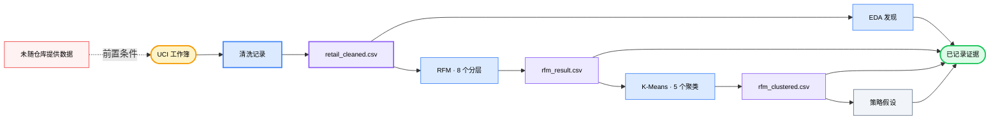

<div align="center">

# 🛍️ E-Commerce User Analysis

### *把两年的零售交易转化为可检查的客户分层、聚类交叉核查和策略假设。*

[](#analysis-tracks)
[](#reproduce)
[](https://archive.ics.uci.edu/dataset/502/online+retail+ii)
[](#methodology)
[](https://github.com/okht/ecommerce-user-analysis)

[](#dashboard)
[](#snapshot)
[](#generated-files)
[](#data-and-citation)

<br>

<table>
<tr><td align="left">

🧹 &nbsp;1,067,371 条交易中包含客户 ID 缺失、取消订单和非正数值。<br>
📊 &nbsp;客户消费中位数为 £899，均值达到 £3,019。<br>
🔍 &nbsp;基于规则的 RFM 分组可能掩盖极端客户和类似批发的行为。

</td></tr>
</table>

### ✨ 将原始交易转化为可追溯的分层证据，并保留清洗决策和模型边界。

**UCI 工作簿 → 数据清洗 → EDA + RFM → K-Means 交叉核查 → CSV 产物 + Dashboard 视图**

<br>

[📚 快照](#snapshot) · [🔬 分析](#analysis-tracks) · [📈 结果](#recorded-results) · [🗺️ 工作流](#workflow) · [🚀 复现](#reproduce) · [🛡️ 数据](#data-and-citation) · [🧪 验证](#verification) · [📁 结构](#project-structure) · [📌 局限](#limitations)

[**English**](README.md) · [**简体中文**](README_CN.md) · [**Español**](README_ES.md) · [**Deutsch**](README_DE.md) · [**日本語**](README_JA.md) · [**Русский**](README_RU.md) · [**Português**](README_PT.md) · [**한국어**](README_KO.md)

</div>

---

<a id="snapshot"></a>

## 📚 快照

仓库中的 Notebook 分析 UCI Online Retail II 工作簿，并保留执行输出供检查。

| 指标 | 已记录数值 | 证据边界 |
|---|---:|---|
| **原始交易** | 1,067,371 行 · 8 个字段 | 两个工作表 |
| **清洗后交易** | 805,549 行 | 已删除客户 ID 缺失、取消订单和非正数值 |
| **时间范围** | 2009-12-01 → 2011-12-09 | 历史零售数据 |
| **实体** | 5,878 名客户 · 36,969 张订单 · 4,631 种商品 · 41 个国家 | 基于清洗后快照计算 |
| **已记录收入** | £17,743,429 | 清洗后按 `Quantity × Price` 计算 |

---

<a id="analysis-tracks"></a>

## 🔬 分析路径

| Notebook | 分析路径 | 已记录产物 |
|---|---|---|
| **`01_data_cleaning.ipynb`** | 加载两个工作表、检查质量并执行清洗规则 | `retail_cleaned.csv` |
| **`02_eda.ipynb.ipynb`** | 探索时间、地域、商品和客户分布 | 已保存的表格和图形 |
| **`03_rfm_analysis.ipynb.ipynb`** | 对最近购买、购买频率和消费金额评分，形成八个规则分组 | `rfm_result.csv` |
| **`04_clustering.ipynb.ipynb`** | 标准化 R/F/M、拟合 K-Means，并将聚类与 RFM 分组比较 | `rfm_clustered.csv` |
| **`05_insights.ipynb.ipynb`** | 汇总分层，并编写建议和实验假设 | 已保存的策略表格和图形 |

---

<a id="recorded-results"></a>

## 📈 已记录结果

以下数值来自已提交 Notebook 中保存的输出。本次 README 更新没有使用未随仓库提供的源工作簿重新执行分析。

| 范围 | 已记录结果 | 解释边界 |
|---|---|---|
| **数据质量** | 243,007 条客户 ID 缺失 · 19,494 条取消记录 | 问题数量存在重叠 |
| **清洗** | 1,067,371 行中保留 805,549 行 | 约占源记录的 75.5% |
| **市场** | 英国贡献 83.0% 的已记录收入 | 只描述这份历史数据 |
| **商品** | 前 20% 商品贡献约 78.4% 收入 | 清洗后快照内的集中度 |
| **客户** | 消费中位数 £898.9 · 均值 £3,018.6 · 最大值 £608,821.6 | 分布高度偏斜 |
| **RFM 集中度** | 1,300 名高价值忠诚客户贡献 68.4% 收入 | 占 5,878 名客户的 22.1% |
| **聚类交叉核查** | 1,523 名 RFM 沉睡客户中有 1,326 名进入沉睡低价值簇 | 重合率 87.1%，不构成因果验证 |

---

<a id="customer-segments"></a>

## 🏷️ 客户分层

| RFM 分层 | 客户数 | 收入占比 | 已记录建议 |
|---|---:|---:|---|
| **高价值忠诚客户** | 1,300 | 68.4% | 保护留存并测试 VIP 待遇 |
| **潜力客户** | 975 | 13.8% | 测试里程碑激励与品类扩展 |
| **流失风险高价值** | 227 | 5.7% | 优先开展召回实验 |
| **一般客户** | 1,102 | 4.6% | 维持标准互动 |
| **沉睡客户** | 1,523 | 3.8% | 使用低成本、有限范围的激活测试 |
| **新客户** | 443 | 2.2% | 测试新手引导和二单激励 |
| **高频低消客户** | 182 | 0.9% | 探索交叉销售和客单价提升 |
| **流失风险一般价值** | 126 | 0.6% | 低运营优先级监测 |

这些建议是从描述性分层推导出的假设。仓库中没有已完成的干预或 A/B 测试结果。

---

<a id="workflow"></a>

## 🗺️ 工作流



---

<a id="methodology"></a>

## ⚙️ 方法

| 阶段 | 已实现方法 | 边界 |
|---|---|---|
| **清洗** | 删除 `Customer ID` 缺失、取消订单、非正数数量或价格，并派生 `Revenue` | 退货和无效记录不进入购买行为分析 |
| **EDA** | 按月份、国家、商品和客户聚合指标 | 仅为描述性分析 |
| **RFM** | 使用 2011-12-10 为快照日期和五分位评分；频率并列值使用 `rank(method="first")` | 八个分层由手写业务规则定义 |
| **K-Means** | 标准化 R/F/M，以肘部形状评估 K=2–10，并用 `random_state=42` 拟合 K=5 | K 为启发式选择，未包含轮廓系数或稳定性研究 |
| **交叉核查** | 使用交叉表和 PCA 可视化比较 RFM 分组与聚类 | 类似批发等聚类标签属于解释 |
| **策略** | 将描述性分层画像转化为优先级、KPI 和 A/B 测试提案 | 提议行动尚未经过实验验证 |

---

<a id="reproduce"></a>

## 🚀 复现

Notebook 中记录的内核版本为 Python 3.13.5。依赖目前未锁定，源工作簿也未随仓库提供。

```powershell
git clone https://github.com/okht/ecommerce-user-analysis.git
cd ecommerce-user-analysis

python -m venv .venv
.\.venv\Scripts\Activate.ps1
python -m pip install pandas numpy matplotlib seaborn plotly scikit-learn streamlit openpyxl jupyter

New-Item -ItemType Directory -Force data
```

从 [UCI 官方数据页](https://archive.ics.uci.edu/dataset/502/online+retail+ii) 下载 `online_retail_II.xlsx`，并放到 `data/online_retail_II.xlsx`。随后按顺序执行真实的 Notebook 文件名：

```powershell
$notebooks = @(
  'notebook/01_data_cleaning.ipynb',
  'notebook/02_eda.ipynb.ipynb',
  'notebook/03_rfm_analysis.ipynb.ipynb',
  'notebook/04_clustering.ipynb.ipynb',
  'notebook/05_insights.ipynb.ipynb'
)

foreach ($notebook in $notebooks) {
  jupyter nbconvert --to notebook --execute --ExecutePreprocessor.timeout=600 --stdout $notebook > $null
  if ($LASTEXITCODE -ne 0) { exit $LASTEXITCODE }
}
```

执行会在 `data/` 下写入三个生成的 CSV 文件。

---

<a id="generated-files"></a>

## 📦 生成文件

| 文件 | 生成者 | 使用者 |
|---|---|---|
| **`data/retail_cleaned.csv`** | `01_data_cleaning.ipynb` | EDA、RFM 和 Dashboard |
| **`data/rfm_result.csv`** | `03_rfm_analysis.ipynb.ipynb` | K-Means 交叉核查 |
| **`data/rfm_clustered.csv`** | `04_clustering.ipynb.ipynb` | 策略 Notebook 和 Dashboard |

这些文件已被 Git 忽略，在新克隆的仓库中不存在。

---

<a id="dashboard"></a>

## 📊 Dashboard

`dashboard/app.py` 从仓库本地的 `data/` 目录读取生成的 CSV，并提供三个 Streamlit 标签页：销售趋势、客户分层和策略建议。

```powershell
streamlit run dashboard/app.py
```

请先执行 Notebook 流程。仓库没有 Dashboard 截图或托管部署，页面还会从 Google Fonts 请求字体样式表。

---

<a id="data-and-citation"></a>

## 🛡️ 数据与引用

| 主题 | 当前状态 |
|---|---|
| **来源** | UCI Machine Learning Repository，Online Retail II |
| **引用** | Chen, D. (2012). *Online Retail II* [Dataset]. DOI：[10.24432/C5CG6D](https://doi.org/10.24432/C5CG6D) |
| **数据集许可证** | UCI 页面标注为 [CC BY 4.0](https://creativecommons.org/licenses/by/4.0/) |
| **仓库代码许可证** | 尚未声明代码许可证 |
| **随仓库提供的数据** | 原始工作簿和生成的 CSV 均排除在 Git 之外 |
| **标识符** | 数据集包含数字客户标识符；共享派生文件前应进行检查 |
| **外部请求** | Dashboard 样式表会请求 Google Fonts；分析代码读取本地数据文件 |

数据集许可证适用于 UCI 数据，不涵盖本仓库代码。

---

<a id="verification"></a>

## 🧪 验证

以下非破坏性检查用于验证 Python 语法和五份 Notebook 文档：

```powershell
python -c "import ast, pathlib; ast.parse(pathlib.Path('dashboard/app.py').read_text(encoding='utf-8')); print('dashboard/app.py: syntax OK')"
python -c "import nbformat, pathlib; files=sorted(pathlib.Path('notebook').glob('*.ipynb*')); [nbformat.validate(nbformat.read(p, as_version=4)) for p in files]; print(f'{len(files)} notebooks: nbformat validation OK')"
```

| 检查 | 状态 |
|---|---|
| **Dashboard AST** | 已在本地通过 |
| **Notebook JSON 和结构** | 五份文件已在本地通过 |
| **Notebook 端到端执行** | 源工作簿未随仓库提供，因此未运行 |
| **Dashboard 冒烟测试** | 生成的 CSV 未随仓库提供，因此未运行 |
| **自动化测试** | 未包含测试套件 |

---

<a id="project-structure"></a>

## 📁 项目结构

```text
ecommerce-user-analysis/
├── dashboard/
│   └── app.py
├── notebook/
│   ├── 01_data_cleaning.ipynb
│   ├── 02_eda.ipynb.ipynb
│   ├── 03_rfm_analysis.ipynb.ipynb
│   ├── 04_clustering.ipynb.ipynb
│   └── 05_insights.ipynb.ipynb
├── .gitignore
├── README.md
├── README_CN.md
├── README_ES.md
├── README_DE.md
├── README_JA.md
├── README_RU.md
├── README_PT.md
└── README_KO.md
```

重复的 `.ipynb.ipynb` 扩展名是当前真实文件名，为保证复现路径而保留。

---

<a id="limitations"></a>

## 📌 局限

- UCI 工作簿和生成的 CSV 文件未随仓库提供。
- 依赖未锁定，也没有 requirements 或锁文件。
- 本次检查了保存的 Notebook 输出，但没有重新执行完整流程。
- K=5 通过肘部图启发式选择，未包含轮廓系数、稳定性或留出分析。
- 分层建议、KPI 目标和 A/B 测试设计均为假设，没有干预结果。
- 数据覆盖 2009–2011 年，不适合作为当前市场证据。
- Dashboard 依赖生成的 CSV，且没有托管演示或已提交预览。
- 未包含自动化测试、CI 工作流、标签或 Release。
- 仓库代码尚未声明许可证；数据集的 CC BY 4.0 许可证独立适用。

欢迎提交 Issue 和 Pull Request。

---

<div align="center">

**让每个客户分层都能追溯到清洗规则、证据和边界。**

<br>

仓库代码尚未声明许可证 · 由 [okht](https://github.com/okht) 维护

</div>
