<div align="center">

# 🛍️ E-Commerce User Analysis

### *Zwei Jahre Einzelhandelstransaktionen in nachvollziehbare Kundensegmente, Cluster-Gegenprüfungen und Strategiehypothesen überführen.*

[](#analysis-tracks)
[](#reproduce)
[](https://archive.ics.uci.edu/dataset/502/online+retail+ii)
[](#methodology)
[](https://github.com/okht/ecommerce-user-analysis)

[](#dashboard)
[](#snapshot)
[](#generated-files)
[](#data-and-citation)

<br>

<table>
<tr><td align="left">

🧹 &nbsp;1,067,371 Transaktionen enthalten fehlende IDs, Stornierungen und nichtpositive Werte.<br>
📊 &nbsp;Der Median der Kundenausgaben liegt bei £899, während der Mittelwert £3,019 erreicht.<br>
🔍 &nbsp;Regelbasierte RFM-Gruppen können extremes und großhandelsähnliches Kundenverhalten verdecken.

</td></tr>
</table>

### ✨ Rohtransaktionen in nachvollziehbare Segmentnachweise überführen, ohne Bereinigungsentscheidungen oder Modellgrenzen zu verschleiern.

**UCI-Arbeitsmappe → Bereinigung → EDA + RFM → K-Means-Gegenprüfung → CSV-Artefakte + Dashboard-Ansichten**

<br>

[📚 Überblick](#snapshot) · [🔬 Analyse](#analysis-tracks) · [📈 Ergebnisse](#recorded-results) · [🗺️ Ablauf](#workflow) · [🚀 Reproduzieren](#reproduce) · [🛡️ Daten](#data-and-citation) · [🧪 Prüfung](#verification) · [📁 Struktur](#project-structure) · [📌 Einschränkungen](#limitations)

[**English**](README.md) · [**简体中文**](README_CN.md) · [**Español**](README_ES.md) · [**Deutsch**](README_DE.md) · [**日本語**](README_JA.md) · [**Русский**](README_RU.md) · [**Português**](README_PT.md) · [**한국어**](README_KO.md)

</div>

---

<a id="snapshot"></a>

## 📚 Überblick

Die versionierten Notebooks analysieren die UCI-Arbeitsmappe Online Retail II und bewahren ihre aufgezeichneten Ausgaben zur Überprüfung auf.

| Kennzahl | Aufgezeichneter Wert | Evidenzgrenze |
|---|---:|---|
| **Rohtransaktionen** | 1,067,371 Zeilen · 8 Felder | Zwei Arbeitsblätter der Arbeitsmappe |
| **Bereinigte Transaktionen** | 805,549 Zeilen | Fehlende Kunden-IDs, Stornierungen und nichtpositive Werte entfernt |
| **Zeitraum** | 2009-12-01 → 2011-12-09 | Historische Einzelhandelsdaten |
| **Entitäten** | 5,878 Kunden · 36,969 Bestellungen · 4,631 Produkte · 41 Länder | Aus dem bereinigten Datenstand abgeleitet |
| **Aufgezeichneter Umsatz** | £17,743,429 | `Quantity × Price` nach der Bereinigung |

---

<a id="analysis-tracks"></a>

## 🔬 Analysepfade

| Notebook | Pfad | Aufgezeichnetes Artefakt |
|---|---|---|
| **`01_data_cleaning.ipynb`** | Lädt beide Arbeitsblätter, prüft die Qualität und wendet Bereinigungsregeln an | `retail_cleaned.csv` |
| **`02_eda.ipynb.ipynb`** | Untersucht zeitliche, geografische, produkt- und kundenbezogene Verteilungen | Gespeicherte Tabellen und Abbildungen |
| **`03_rfm_analysis.ipynb.ipynb`** | Bewertet Recency, Frequency und Monetary Value und bildet acht regelbasierte Gruppen | `rfm_result.csv` |
| **`04_clustering.ipynb.ipynb`** | Standardisiert R/F/M, passt K-Means an und vergleicht Cluster mit RFM-Gruppen | `rfm_clustered.csv` |
| **`05_insights.ipynb.ipynb`** | Fasst Segmente zusammen und formuliert Empfehlungen sowie Experimenthypothesen | Gespeicherte Strategietabellen und Abbildungen |

---

<a id="recorded-results"></a>

## 📈 Aufgezeichnete Ergebnisse

Diese Werte stammen aus den Ausgaben, die in den versionierten Notebooks gespeichert sind. Bei dieser README-Aktualisierung wurden sie nicht erneut aus der nicht mitgelieferten Quellarbeitsmappe erzeugt.

| Bereich | Aufgezeichnetes Ergebnis | Interpretationsgrenze |
|---|---|---|
| **Datenqualität** | 243,007 fehlende Kunden-IDs · 19,494 Stornierungszeilen | Die Problemzählungen überschneiden sich |
| **Bereinigung** | 805,549 von 1,067,371 Zeilen beibehalten | Etwa 75.5% der Quellzeilen |
| **Markt** | Das Vereinigte Königreich trägt 83.0% zum aufgezeichneten Umsatz bei | Deskriptives Ergebnis für diesen historischen Datensatz |
| **Produkte** | Die obersten 20% tragen etwa 78.4% zum Umsatz bei | Konzentration innerhalb des bereinigten Datenstands |
| **Kunden** | Median der Ausgaben £898.9 · Mittelwert £3,018.6 · Maximum £608,821.6 | Stark schiefe Verteilung |
| **RFM-Konzentration** | 1,300 treue, hochwertige Kunden tragen 68.4% zum Umsatz bei | 22.1% der 5,878 Kunden |
| **Cluster-Gegenprüfung** | 1,326 von 1,523 inaktiven RFM-Kunden landen im inaktiven Niedrigwert-Cluster | 87.1% Überschneidung; keine kausale Validierung |

---

<a id="customer-segments"></a>

## 🏷️ Kundensegmente

| RFM-Segment | Kunden | Umsatzanteil | Aufgezeichnete Empfehlung |
|---|---:|---:|---|
| **Treue Kunden mit hohem Wert** | 1,300 | 68.4% | Bindung schützen und VIP-Behandlung testen |
| **Hohes Potenzial** | 975 | 13.8% | Meilensteine und Kategorieerweiterung testen |
| **Gefährdete Kunden mit hohem Wert** | 227 | 5.7% | Rückgewinnungsexperimente priorisieren |
| **Stammkunden** | 1,102 | 4.6% | Standardansprache beibehalten |
| **Inaktive Kunden** | 1,523 | 3.8% | Kostengünstige, begrenzte Reaktivierungstests einsetzen |
| **Neue Kunden** | 443 | 2.2% | Onboarding und Impulse für eine zweite Bestellung testen |
| **Häufige Kunden mit geringen Ausgaben** | 182 | 0.9% | Cross-Selling und eine Steigerung des Bestellwerts untersuchen |
| **Gefährdete Stammkunden** | 126 | 0.6% | Mit niedriger operativer Priorität beobachten |

Die Empfehlungen sind Hypothesen, die aus der deskriptiven Segmentierung abgeleitet wurden. Das Repository enthält keine Ergebnisse abgeschlossener Interventionen oder A/B-Tests.

---

<a id="workflow"></a>

## 🗺️ Ablauf

```mermaid
flowchart LR
    N["Daten nicht mitgeliefert"] -. Voraussetzung .-> A([UCI-Arbeitsmappe])

    A --> B["Datensätze bereinigen"] --> C["retail_cleaned.csv"]
    C --> D["EDA-Erkenntnisse"] --> L([Aufgezeichnete Evidenz])
    C --> E["RFM · 8 Segmente"] --> F["rfm_result.csv"] --> L
    F --> G["K-Means · 5 Cluster"] --> H["rfm_clustered.csv"] --> L
    H --> I["Strategiehypothesen"] --> L

    style N fill:#FEF2F2,stroke:#EF4444,stroke-width:1px,color:#000,font-size:12px
    style A fill:#FEF3C7,stroke:#F59E0B,stroke-width:2px,color:#000,font-size:12px
    style B fill:#DBEAFE,stroke:#3B82F6,stroke-width:2px,color:#000,font-size:12px
    style C fill:#EDE9FE,stroke:#8B5CF6,stroke-width:2px,color:#000,font-size:12px
    style D fill:#DBEAFE,stroke:#3B82F6,stroke-width:1px,color:#000,font-size:12px
    style E fill:#DBEAFE,stroke:#3B82F6,stroke-width:1px,color:#000,font-size:12px
    style F fill:#EDE9FE,stroke:#8B5CF6,stroke-width:1px,color:#000,font-size:12px
    style G fill:#DBEAFE,stroke:#3B82F6,stroke-width:1px,color:#000,font-size:12px
    style H fill:#EDE9FE,stroke:#8B5CF6,stroke-width:1px,color:#000,font-size:12px
    style I fill:#F1F5F9,stroke:#64748B,stroke-width:1px,color:#000,font-size:12px
    style L fill:#DCFCE7,stroke:#22C55E,stroke-width:2px,color:#000,font-size:12px
```



---

<a id="methodology"></a>

## ⚙️ Methodik

| Phase | Implementierte Methode | Grenze |
|---|---|---|
| **Bereinigung** | Entfernt fehlende `Customer ID`-Werte, Stornierungsrechnungen sowie nichtpositive Mengen oder Preise; leitet `Revenue` ab | Retouren und ungültige Zeilen werden vom Kaufverhalten ausgeschlossen |
| **EDA** | Aggregiert monatliche, länder-, produkt- und kundenbezogene Kennzahlen | Ausschließlich deskriptive Analyse |
| **RFM** | Verwendet den Stichtag 2011-12-10 und Quintilbewertungen; Häufigkeitsgleichstände verwenden `rank(method="first")` | Die acht Segmente sind manuell formulierte Geschäftsregeln |
| **K-Means** | Standardisiert R/F/M, bewertet K=2–10 anhand der Ellenbogenform und passt dann K=5 mit `random_state=42` an | K ist heuristisch; eine Silhouetten- oder Stabilitätsstudie ist nicht enthalten |
| **Gegenprüfung** | Vergleicht RFM-Gruppen und Cluster mit einer Kreuztabelle und einer PCA-Visualisierung | Clusterbezeichnungen wie großhandelsähnlich sind Interpretationen |
| **Strategie** | Überführt deskriptive Segmentprofile in Prioritäten, KPIs und A/B-Testvorschläge | Die vorgeschlagenen Maßnahmen wurden nicht experimentell validiert |

---

<a id="reproduce"></a>

## 🚀 Reproduzieren

Der aufgezeichnete Notebook-Kernel ist Python 3.13.5. Die Abhängigkeiten sind derzeit nicht auf feste Versionen gesetzt, und die Quellarbeitsmappe ist nicht enthalten.

```powershell
git clone https://github.com/okht/ecommerce-user-analysis.git
cd ecommerce-user-analysis

python -m venv .venv
.\.venv\Scripts\Activate.ps1
python -m pip install pandas numpy matplotlib seaborn plotly scikit-learn streamlit openpyxl jupyter

New-Item -ItemType Directory -Force data
```

Lade `online_retail_II.xlsx` von der [offiziellen UCI-Datensatzseite](https://archive.ics.uci.edu/dataset/502/online+retail+ii) herunter und lege die Datei unter `data/online_retail_II.xlsx` ab. Führe anschließend die tatsächlichen Notebook-Dateinamen in dieser Reihenfolge aus:

```powershell
$notebooks = @(
  'notebook/01_data_cleaning.ipynb',
  'notebook/02_eda.ipynb.ipynb',
  'notebook/03_rfm_analysis.ipynb.ipynb',
  'notebook/04_clustering.ipynb.ipynb',
  'notebook/05_insights.ipynb.ipynb'
)

foreach ($notebook in $notebooks) {
  jupyter nbconvert --to notebook --execute --ExecutePreprocessor.timeout=600 --stdout $notebook > $null
  if ($LASTEXITCODE -ne 0) { exit $LASTEXITCODE }
}
```

Diese Ausführung schreibt die drei erzeugten CSV-Dateien in `data/`.

---

<a id="generated-files"></a>

## 📦 Erzeugte Dateien

| Datei | Erzeuger | Verbraucher |
|---|---|---|
| **`data/retail_cleaned.csv`** | `01_data_cleaning.ipynb` | EDA, RFM und Dashboard |
| **`data/rfm_result.csv`** | `03_rfm_analysis.ipynb.ipynb` | K-Means-Gegenprüfung |
| **`data/rfm_clustered.csv`** | `04_clustering.ipynb.ipynb` | Strategie-Notebook und Dashboard |

Diese Dateien werden von Git ignoriert und sind in einem frischen Klon nicht vorhanden.

---

<a id="dashboard"></a>

## 📊 Dashboard

`dashboard/app.py` liest die erzeugten CSV-Dateien aus dem repositorylokalen Verzeichnis `data/` und stellt drei Streamlit-Registerkarten bereit: Verkaufstrends, Kundensegmente und Strategieempfehlungen.

```powershell
streamlit run dashboard/app.py
```

Führe zuerst die Notebook-Pipeline aus. Es sind weder ein Dashboard-Screenshot noch eine gehostete Bereitstellung enthalten, und die Seite importiert ein Schriftarten-Stylesheet von Google Fonts.

---

<a id="data-and-citation"></a>

## 🛡️ Daten und Zitierung

| Thema | Aktueller Status |
|---|---|
| **Quelle** | UCI Machine Learning Repository, Online Retail II |
| **Zitierung** | Chen, D. (2012). *Online Retail II* [Datensatz]. DOI: [10.24432/C5CG6D](https://doi.org/10.24432/C5CG6D) |
| **Datensatzlizenz** | [CC BY 4.0](https://creativecommons.org/licenses/by/4.0/) laut UCI-Seite |
| **Lizenz des Repository-Codes** | Für den Code wurde keine Lizenz angegeben |
| **Mitgelieferte Daten** | Die Roharbeitsmappe und die erzeugten CSV-Dateien sind von Git ausgeschlossen |
| **Identifikatoren** | Der Datensatz enthält numerische Kundenkennungen; prüfe abgeleitete Dateien vor der Weitergabe |
| **Externe Anfrage** | Das Dashboard-Stylesheet ruft Google Fonts ab; der Analysecode liest ansonsten lokale Datendateien |

Die Datensatzlizenz gilt für die UCI-Daten. Sie lizenziert den Code dieses Repositorys nicht.

---

<a id="verification"></a>

## 🧪 Prüfung

Die folgenden nichtdestruktiven Prüfungen validieren die Python-Syntax und die fünf Notebook-Dokumente:

```powershell
python -c "import ast, pathlib; ast.parse(pathlib.Path('dashboard/app.py').read_text(encoding='utf-8')); print('dashboard/app.py: syntax OK')"
python -c "import nbformat, pathlib; files=sorted(pathlib.Path('notebook').glob('*.ipynb*')); [nbformat.validate(nbformat.read(p, as_version=4)) for p in files]; print(f'{len(files)} notebooks: nbformat validation OK')"
```

| Prüfung | Status |
|---|---|
| **Dashboard-AST** | Lokal bestanden |
| **Notebook-JSON und -Schema** | Fünf Dateien haben die lokale Prüfung bestanden |
| **End-to-End-Ausführung der Notebooks** | Nicht ausgeführt, da die Quellarbeitsmappe nicht mitgeliefert wird |
| **Dashboard-Smoke-Test** | Nicht ausgeführt, da die erzeugten CSV-Dateien nicht mitgeliefert werden |
| **Automatisierte Tests** | Keine Testsuite enthalten |

---

<a id="project-structure"></a>

## 📁 Projektstruktur

```text
ecommerce-user-analysis/
├── dashboard/
│   └── app.py
├── notebook/
│   ├── 01_data_cleaning.ipynb
│   ├── 02_eda.ipynb.ipynb
│   ├── 03_rfm_analysis.ipynb.ipynb
│   ├── 04_clustering.ipynb.ipynb
│   └── 05_insights.ipynb.ipynb
├── .gitignore
├── README.md
├── README_CN.md
├── README_ES.md
├── README_DE.md
├── README_JA.md
├── README_RU.md
├── README_PT.md
└── README_KO.md
```

Die wiederholten Endungen `.ipynb.ipynb` sind die aktuellen Dateinamen und bleiben für die Reproduzierbarkeit erhalten.

---

<a id="limitations"></a>

## 📌 Einschränkungen

- Die UCI-Arbeitsmappe und die erzeugten CSV-Dateien werden nicht mitgeliefert.
- Abhängigkeiten sind nicht auf feste Versionen gesetzt, und es ist weder eine Anforderungs- noch eine Lockdatei enthalten.
- Die gespeicherten Notebook-Ausgaben wurden geprüft, die vollständige Pipeline wurde bei dieser README-Aktualisierung jedoch nicht erneut ausgeführt.
- K=5 wird heuristisch aus einem Ellenbogendiagramm ausgewählt; eine Silhouetten-, Stabilitäts- oder Holdout-Analyse ist nicht enthalten.
- Segmentempfehlungen, KPI-Ziele und A/B-Testdesigns sind Hypothesen ohne Interventionsergebnisse.
- Der Datensatz deckt 2009–2011 ab und sollte nicht als Beleg für den aktuellen Markt dargestellt werden.
- Das Dashboard benötigt die erzeugten CSV-Dateien und besitzt weder eine gehostete Demo noch eine versionierte Vorschau.
- Automatisierte Tests, CI-Workflow, Tag und Release sind nicht enthalten.
- Für den Repository-Code wurde keine Lizenz angegeben; die CC-BY-4.0-Lizenz des Datensatzes bleibt davon getrennt.

Issues und Pull Requests sind willkommen.

---

<div align="center">

**Jedes Kundensegment soll bis zu seinen Bereinigungsregeln, Nachweisen und Grenzen nachvollziehbar bleiben.**

<br>

Keine Codelizenz angegeben · Betreut von [okht](https://github.com/okht)

</div>
