<div align="center">

# 🛍️ E-Commerce User Analysis

### *Convierte dos años de transacciones minoristas en segmentos de clientes auditables, contrastes de clústeres e hipótesis estratégicas.*

[](#analysis-tracks)
[](#reproduce)
[](https://archive.ics.uci.edu/dataset/502/online+retail+ii)
[](#methodology)
[](https://github.com/okht/ecommerce-user-analysis)

[](#dashboard)
[](#snapshot)
[](#generated-files)
[](#data-and-citation)

<br>

<table>
<tr><td align="left">

🧹 &nbsp;1,067,371 transacciones contienen identificadores ausentes, cancelaciones y valores no positivos.<br>
📊 &nbsp;La mediana del gasto por cliente es de £899, mientras que la media alcanza £3,019.<br>
🔍 &nbsp;Los grupos RFM basados en reglas pueden ocultar comportamientos extremos y similares a los de clientes mayoristas.

</td></tr>
</table>

### ✨ Convierte transacciones sin procesar en evidencia trazable sobre segmentos, sin ocultar las decisiones de limpieza ni los límites del modelo.

**Libro de UCI → limpieza → EDA + RFM → contraste con K-Means → artefactos CSV + vistas del Dashboard**

<br>

[📚 Resumen](#snapshot) · [🔬 Análisis](#analysis-tracks) · [📈 Resultados](#recorded-results) · [🗺️ Flujo de trabajo](#workflow) · [🚀 Reproducir](#reproduce) · [🛡️ Datos](#data-and-citation) · [🧪 Verificación](#verification) · [📁 Estructura](#project-structure) · [📌 Limitaciones](#limitations)

[**English**](README.md) · [**简体中文**](README_CN.md) · [**Español**](README_ES.md) · [**Deutsch**](README_DE.md) · [**日本語**](README_JA.md) · [**Русский**](README_RU.md) · [**Português**](README_PT.md) · [**한국어**](README_KO.md)

</div>

---

<a id="snapshot"></a>

## 📚 Resumen

Los notebooks incluidos en el repositorio analizan el libro de UCI Online Retail II y conservan sus resultados registrados para poder inspeccionarlos.

| Métrica | Valor registrado | Límite de la evidencia |
|---|---:|---|
| **Transacciones sin procesar** | 1,067,371 filas · 8 campos | Dos hojas del libro |
| **Transacciones limpias** | 805,549 filas | Se eliminaron los identificadores de cliente ausentes, las cancelaciones y los valores no positivos |
| **Periodo** | 2009-12-01 → 2011-12-09 | Datos minoristas históricos |
| **Entidades** | 5,878 clientes · 36,969 pedidos · 4,631 productos · 41 países | Derivadas de la instantánea limpia |
| **Ingresos registrados** | £17,743,429 | `Quantity × Price` después de la limpieza |

---

<a id="analysis-tracks"></a>

## 🔬 Líneas de análisis

| Notebook | Línea | Artefacto registrado |
|---|---|---|
| **`01_data_cleaning.ipynb`** | Carga ambas hojas, audita la calidad y aplica las reglas de limpieza | `retail_cleaned.csv` |
| **`02_eda.ipynb.ipynb`** | Explora las distribuciones temporales, geográficas, de productos y de clientes | Tablas y figuras guardadas |
| **`03_rfm_analysis.ipynb.ipynb`** | Puntúa Recencia, Frecuencia y Valor monetario para formar ocho grupos basados en reglas | `rfm_result.csv` |
| **`04_clustering.ipynb.ipynb`** | Estandariza R/F/M, ajusta K-Means y compara los clústeres con los grupos RFM | `rfm_clustered.csv` |
| **`05_insights.ipynb.ipynb`** | Resume los segmentos y formula recomendaciones e hipótesis de experimentos | Tablas y figuras de estrategia guardadas |

---

<a id="recorded-results"></a>

## 📈 Resultados registrados

Estos valores proceden de los resultados almacenados en los notebooks incluidos en el repositorio. Durante esta actualización del README no se volvieron a ejecutar a partir del libro de origen, que no está incluido.

| Área | Resultado registrado | Límite de interpretación |
|---|---|---|
| **Calidad de los datos** | 243,007 identificadores de cliente ausentes · 19,494 filas de cancelaciones | Los recuentos de incidencias se solapan |
| **Limpieza** | Se conservaron 805,549 de 1,067,371 filas | Aproximadamente el 75.5% de las filas de origen |
| **Mercado** | El Reino Unido aporta el 83.0% de los ingresos registrados | Resultado descriptivo para este conjunto de datos histórico |
| **Productos** | El 20% superior aporta aproximadamente el 78.4% de los ingresos | Concentración dentro de la instantánea limpia |
| **Clientes** | Mediana del gasto £898.9 · media £3,018.6 · máximo £608,821.6 | Distribución muy sesgada |
| **Concentración RFM** | 1,300 clientes leales de alto valor aportan el 68.4% de los ingresos | El 22.1% de los 5,878 clientes |
| **Contraste de clústeres** | 1,326 de 1,523 clientes inactivos según RFM entran en el clúster inactivo de bajo valor | 87.1% de solapamiento; sin validación causal |

---

<a id="customer-segments"></a>

## 🏷️ Segmentos de clientes

| Segmento RFM | Clientes | Proporción de ingresos | Recomendación registrada |
|---|---:|---:|---|
| **Leales de alto valor** | 1,300 | 68.4% | Proteger la retención y probar un trato VIP |
| **Alto potencial** | 975 | 13.8% | Probar hitos y la ampliación de categorías |
| **Alto valor en riesgo** | 227 | 5.7% | Priorizar experimentos de recuperación |
| **Habituales** | 1,102 | 4.6% | Mantener la interacción estándar |
| **Inactivos** | 1,523 | 3.8% | Realizar pruebas de reactivación limitadas y de bajo coste |
| **Nuevos** | 443 | 2.2% | Probar la incorporación y los incentivos para un segundo pedido |
| **Frecuentes con bajo gasto** | 182 | 0.9% | Explorar la venta cruzada y el aumento del valor del pedido |
| **Habituales en riesgo** | 126 | 0.6% | Supervisar con una prioridad operativa baja |

Las recomendaciones son hipótesis derivadas de una segmentación descriptiva. El repositorio no contiene resultados de intervenciones ni de pruebas A/B completadas.

---

<a id="workflow"></a>

## 🗺️ Flujo de trabajo

```mermaid
flowchart LR
    N["Datos no incluidos"] -. requisito previo .-> A([Libro de UCI])

    A --> B["Limpiar registros"] --> C["retail_cleaned.csv"]
    C --> D["Hallazgos de EDA"] --> L([Evidencia registrada])
    C --> E["RFM · 8 segmentos"] --> F["rfm_result.csv"] --> L
    F --> G["K-Means · 5 clústeres"] --> H["rfm_clustered.csv"] --> L
    H --> I["Hipótesis estratégicas"] --> L

    style N fill:#FEF2F2,stroke:#EF4444,stroke-width:1px,color:#000,font-size:12px
    style A fill:#FEF3C7,stroke:#F59E0B,stroke-width:2px,color:#000,font-size:12px
    style B fill:#DBEAFE,stroke:#3B82F6,stroke-width:2px,color:#000,font-size:12px
    style C fill:#EDE9FE,stroke:#8B5CF6,stroke-width:2px,color:#000,font-size:12px
    style D fill:#DBEAFE,stroke:#3B82F6,stroke-width:1px,color:#000,font-size:12px
    style E fill:#DBEAFE,stroke:#3B82F6,stroke-width:1px,color:#000,font-size:12px
    style F fill:#EDE9FE,stroke:#8B5CF6,stroke-width:1px,color:#000,font-size:12px
    style G fill:#DBEAFE,stroke:#3B82F6,stroke-width:1px,color:#000,font-size:12px
    style H fill:#EDE9FE,stroke:#8B5CF6,stroke-width:1px,color:#000,font-size:12px
    style I fill:#F1F5F9,stroke:#64748B,stroke-width:1px,color:#000,font-size:12px
    style L fill:#DCFCE7,stroke:#22C55E,stroke-width:2px,color:#000,font-size:12px
```



---

<a id="methodology"></a>

## ⚙️ Metodología

| Etapa | Método implementado | Límite |
|---|---|---|
| **Limpieza** | Elimina los valores ausentes de `Customer ID`, las facturas de cancelación y las cantidades o precios no positivos; deriva `Revenue` | Las devoluciones y las filas no válidas quedan excluidas del comportamiento de compra |
| **EDA** | Agrega métricas mensuales, por país, por producto y por cliente | Solo análisis descriptivo |
| **RFM** | Usa la fecha de corte 2011-12-10 y puntuaciones por quintiles; los empates de frecuencia usan `rank(method="first")` | Los ocho segmentos son reglas de negocio escritas manualmente |
| **K-Means** | Estandariza R/F/M, evalúa K=2–10 según la forma del codo y luego ajusta K=5 con `random_state=42` | K es heurístico; no se incluye ningún estudio de silueta ni de estabilidad |
| **Contraste** | Usa una tabla cruzada y una visualización PCA para comparar los grupos RFM y los clústeres | Las etiquetas de clústeres, como similares a mayoristas, son interpretaciones |
| **Estrategia** | Convierte perfiles descriptivos de segmentos en prioridades, KPI y propuestas de pruebas A/B | Las acciones propuestas no se han validado experimentalmente |

---

<a id="reproduce"></a>

## 🚀 Reproducir

El kernel registrado de los notebooks es Python 3.13.5. Actualmente, las dependencias no tienen versiones fijadas y el libro de origen no está incluido.

```powershell
git clone https://github.com/okht/ecommerce-user-analysis.git
cd ecommerce-user-analysis

python -m venv .venv
.\.venv\Scripts\Activate.ps1
python -m pip install pandas numpy matplotlib seaborn plotly scikit-learn streamlit openpyxl jupyter

New-Item -ItemType Directory -Force data
```

Descarga `online_retail_II.xlsx` desde la [página oficial del conjunto de datos de UCI](https://archive.ics.uci.edu/dataset/502/online+retail+ii) y colócalo en `data/online_retail_II.xlsx`. A continuación, ejecuta en orden los nombres reales de los notebooks:

```powershell
$notebooks = @(
  'notebook/01_data_cleaning.ipynb',
  'notebook/02_eda.ipynb.ipynb',
  'notebook/03_rfm_analysis.ipynb.ipynb',
  'notebook/04_clustering.ipynb.ipynb',
  'notebook/05_insights.ipynb.ipynb'
)

foreach ($notebook in $notebooks) {
  jupyter nbconvert --to notebook --execute --ExecutePreprocessor.timeout=600 --stdout $notebook > $null
  if ($LASTEXITCODE -ne 0) { exit $LASTEXITCODE }
}
```

Esta ejecución escribe los tres archivos CSV generados dentro de `data/`.

---

<a id="generated-files"></a>

## 📦 Archivos generados

| Archivo | Productor | Consumidor |
|---|---|---|
| **`data/retail_cleaned.csv`** | `01_data_cleaning.ipynb` | EDA, RFM y Dashboard |
| **`data/rfm_result.csv`** | `03_rfm_analysis.ipynb.ipynb` | Contraste con K-Means |
| **`data/rfm_clustered.csv`** | `04_clustering.ipynb.ipynb` | Notebook de estrategia y Dashboard |

Git ignora estos archivos y no están presentes en un clon recién creado.

---

<a id="dashboard"></a>

## 📊 Dashboard

`dashboard/app.py` lee los archivos CSV generados desde el directorio `data/` local del repositorio y ofrece tres pestañas de Streamlit: tendencias de ventas, segmentos de clientes y recomendaciones estratégicas.

```powershell
streamlit run dashboard/app.py
```

Ejecuta primero el flujo de notebooks. No se incluye ninguna captura de pantalla del Dashboard ni un despliegue alojado, y la página importa una hoja de estilos de fuentes desde Google Fonts.

---

<a id="data-and-citation"></a>

## 🛡️ Datos y cita

| Tema | Estado actual |
|---|---|
| **Fuente** | UCI Machine Learning Repository, Online Retail II |
| **Cita** | Chen, D. (2012). *Online Retail II* [Conjunto de datos]. DOI: [10.24432/C5CG6D](https://doi.org/10.24432/C5CG6D) |
| **Licencia del conjunto de datos** | [CC BY 4.0](https://creativecommons.org/licenses/by/4.0/) según la página de UCI |
| **Licencia del código del repositorio** | No se ha declarado ninguna licencia para el código |
| **Datos incluidos** | El libro sin procesar y los archivos CSV generados están excluidos de Git |
| **Identificadores** | El conjunto de datos contiene identificadores numéricos de clientes; revisa los archivos derivados antes de compartirlos |
| **Solicitud externa** | La hoja de estilos del Dashboard solicita Google Fonts; por lo demás, el código de análisis lee archivos de datos locales |

La licencia del conjunto de datos se aplica a los datos de UCI. No concede licencia al código de este repositorio.

---

<a id="verification"></a>

## 🧪 Verificación

Las siguientes comprobaciones no destructivas validan la sintaxis de Python y los cinco documentos de notebook:

```powershell
python -c "import ast, pathlib; ast.parse(pathlib.Path('dashboard/app.py').read_text(encoding='utf-8')); print('dashboard/app.py: syntax OK')"
python -c "import nbformat, pathlib; files=sorted(pathlib.Path('notebook').glob('*.ipynb*')); [nbformat.validate(nbformat.read(p, as_version=4)) for p in files]; print(f'{len(files)} notebooks: nbformat validation OK')"
```

| Comprobación | Estado |
|---|---|
| **AST del Dashboard** | Superada localmente |
| **JSON y esquema de los notebooks** | Cinco archivos superaron la comprobación local |
| **Ejecución integral de los notebooks** | No se ejecutó porque el libro de origen no está incluido |
| **Prueba de humo del Dashboard** | No se ejecutó porque los archivos CSV generados no están incluidos |
| **Pruebas automatizadas** | No se incluye ninguna suite de pruebas |

---

<a id="project-structure"></a>

## 📁 Estructura del proyecto

```text
ecommerce-user-analysis/
├── dashboard/
│   └── app.py
├── notebook/
│   ├── 01_data_cleaning.ipynb
│   ├── 02_eda.ipynb.ipynb
│   ├── 03_rfm_analysis.ipynb.ipynb
│   ├── 04_clustering.ipynb.ipynb
│   └── 05_insights.ipynb.ipynb
├── .gitignore
├── README.md
├── README_CN.md
├── README_ES.md
├── README_DE.md
├── README_JA.md
├── README_RU.md
├── README_PT.md
└── README_KO.md
```

Las extensiones repetidas `.ipynb.ipynb` son los nombres de archivo actuales y se conservan para facilitar la reproducción.

---

<a id="limitations"></a>

## 📌 Limitaciones

- El libro de UCI y los archivos CSV generados no están incluidos.
- Las dependencias no tienen versiones fijadas y no se incluye ningún archivo de requisitos ni de bloqueo.
- Se inspeccionaron los resultados guardados en los notebooks, pero el flujo completo no se volvió a ejecutar durante esta actualización del README.
- K=5 se selecciona de forma heurística a partir de un gráfico de codo; no se incluye ningún análisis de silueta, estabilidad ni conjunto de reserva.
- Las recomendaciones de segmentos, los objetivos de KPI y los diseños de pruebas A/B son hipótesis sin resultados de intervención.
- El conjunto de datos abarca 2009–2011 y no debe presentarse como evidencia del mercado actual.
- El Dashboard requiere los archivos CSV generados y no dispone de una demostración alojada ni de una vista previa incluida en el repositorio.
- No se incluyen pruebas automatizadas, un flujo de CI, una etiqueta ni una versión publicada.
- El código del repositorio no tiene una licencia declarada; la licencia CC BY 4.0 del conjunto de datos permanece separada.

Las incidencias y las solicitudes de incorporación de cambios son bienvenidas.

---

<div align="center">

**Mantén cada segmento de clientes vinculado de forma trazable a sus reglas de limpieza, su evidencia y sus límites.**

<br>

Licencia del código no declarada · Mantenido por [okht](https://github.com/okht)

</div>
