<div align="center">

# 🛍️ E-Commerce User Analysis

### *2年分の小売取引を、検証可能な顧客セグメント、クラスタとのクロスチェック、施策仮説へ。*

[](#analysis-tracks)
[](#reproduce)
[](https://archive.ics.uci.edu/dataset/502/online+retail+ii)
[](#methodology)
[](https://github.com/okht/ecommerce-user-analysis)

[](#dashboard)
[](#snapshot)
[](#generated-files)
[](#data-and-citation)

<br>

<table>
<tr><td align="left">

🧹 &nbsp;1,067,371件の取引には、顧客IDの欠損、キャンセル、ゼロ以下の値が含まれます。<br>
📊 &nbsp;顧客支出の中央値は£899、平均値は£3,019です。<br>
🔍 &nbsp;ルールベースのRFM分類では、極端な行動や卸売に近い顧客行動が見えにくくなる場合があります。

</td></tr>
</table>

### ✨ クリーニングの判断やモデルの限界を隠さず、生の取引データを追跡可能なセグメントの根拠へ変換します。

**UCIワークブック → クリーニング → EDA + RFM → K-Meansによるクロスチェック → CSV成果物 + Dashboard表示**

<br>

[📚 概要](#snapshot) · [🔬 分析](#analysis-tracks) · [📈 結果](#recorded-results) · [🗺️ ワークフロー](#workflow) · [🚀 再現](#reproduce) · [🛡️ データ](#data-and-citation) · [🧪 検証](#verification) · [📁 構成](#project-structure) · [📌 制約](#limitations)

[**English**](README.md) · [**简体中文**](README_CN.md) · [**Español**](README_ES.md) · [**Deutsch**](README_DE.md) · [**日本語**](README_JA.md) · [**Русский**](README_RU.md) · [**Português**](README_PT.md) · [**한국어**](README_KO.md)

</div>

---

<a id="snapshot"></a>

## 📚 概要

リポジトリに含まれるNotebookはUCI Online Retail IIワークブックを分析し、確認できるよう実行結果を保持しています。

| 指標 | 記録値 | エビデンスの範囲 |
|---|---:|---|
| **生の取引** | 1,067,371行 · 8フィールド | ワークブック内の2シート |
| **クリーニング済み取引** | 805,549行 | 顧客IDの欠損、キャンセル、ゼロ以下の値を除外 |
| **対象期間** | 2009-12-01 → 2011-12-09 | 過去の小売データ |
| **エンティティ** | 5,878顧客 · 36,969注文 · 4,631商品 · 41か国 | クリーニング済みスナップショットから算出 |
| **記録済み売上** | £17,743,429 | クリーニング後の`Quantity × Price` |

---

<a id="analysis-tracks"></a>

## 🔬 分析トラック

| Notebook | 分析内容 | 記録済み成果物 |
|---|---|---|
| **`01_data_cleaning.ipynb`** | 2つのシートを読み込み、品質を監査してクリーニングルールを適用 | `retail_cleaned.csv` |
| **`02_eda.ipynb.ipynb`** | 時系列、地域、商品、顧客の分布を探索 | 保存済みの表と図 |
| **`03_rfm_analysis.ipynb.ipynb`** | Recency、Frequency、Monetary Valueをスコア化し、ルールベースの8グループを作成 | `rfm_result.csv` |
| **`04_clustering.ipynb.ipynb`** | R/F/Mを標準化し、K-Meansを適用してクラスタとRFMグループを比較 | `rfm_clustered.csv` |
| **`05_insights.ipynb.ipynb`** | セグメントを要約し、推奨施策と実験仮説を作成 | 保存済みの施策表と図 |

---

<a id="recorded-results"></a>

## 📈 記録済みの結果

以下の値は、リポジトリに含まれるNotebook内に保存された実行結果に基づきます。このREADMEの更新時には、同梱されていない元ワークブックから再実行していません。

| 領域 | 記録済みの結果 | 解釈の範囲 |
|---|---|---|
| **データ品質** | 顧客IDの欠損243,007件 · キャンセル行19,494件 | 問題件数には重複があります |
| **クリーニング** | 1,067,371行のうち805,549行を保持 | 元データの約75.5% |
| **市場** | 記録済み売上の83.0%を英国が占める | この過去データセットに関する記述的な結果 |
| **商品** | 上位20%の商品が売上の約78.4%を占める | クリーニング済みスナップショット内の集中度 |
| **顧客** | 支出中央値£898.9 · 平均£3,018.6 · 最大£608,821.6 | 強い右偏分布 |
| **RFMの集中度** | 1,300人の高価値ロイヤル顧客が売上の68.4%を占める | 5,878顧客の22.1% |
| **クラスタのクロスチェック** | RFMで休眠とされた1,523顧客のうち1,326顧客が休眠・低価値クラスタに入る | 87.1%の重複。因果的な検証は未実施 |

---

<a id="customer-segments"></a>

## 🏷️ 顧客セグメント

| RFMセグメント | 顧客数 | 売上構成比 | 記録済みの推奨施策 |
|---|---:|---:|---|
| **高価値ロイヤル顧客** | 1,300 | 68.4% | 維持率を守り、VIP施策を検証する |
| **高ポテンシャル顧客** | 975 | 13.8% | マイルストーン施策とカテゴリ拡張を検証する |
| **離反リスクのある高価値顧客** | 227 | 5.7% | 呼び戻し実験を優先する |
| **一般顧客** | 1,102 | 4.6% | 標準的なエンゲージメントを維持する |
| **休眠顧客** | 1,523 | 3.8% | 低コストで限定的な再活性化テストを行う |
| **新規顧客** | 443 | 2.2% | オンボーディングと2回目の注文を促す施策を検証する |
| **高頻度・低支出顧客** | 182 | 0.9% | クロスセルと注文単価の向上を検討する |
| **離反リスクのある一般顧客** | 126 | 0.6% | 運用優先度を低くしてモニタリングする |

推奨施策は、記述的なセグメンテーションから導いた仮説です。リポジトリには、完了済みの介入やA/Bテストの結果は含まれていません。

---

<a id="workflow"></a>

## 🗺️ ワークフロー

```mermaid
flowchart LR
    N["データ未同梱"] -. 前提条件 .-> A([UCIワークブック])

    A --> B["レコードをクリーニング"] --> C["retail_cleaned.csv"]
    C --> D["EDAの知見"] --> L([記録済みエビデンス])
    C --> E["RFM · 8セグメント"] --> F["rfm_result.csv"] --> L
    F --> G["K-Means · 5クラスタ"] --> H["rfm_clustered.csv"] --> L
    H --> I["施策仮説"] --> L

    style N fill:#FEF2F2,stroke:#EF4444,stroke-width:1px,color:#000,font-size:12px
    style A fill:#FEF3C7,stroke:#F59E0B,stroke-width:2px,color:#000,font-size:12px
    style B fill:#DBEAFE,stroke:#3B82F6,stroke-width:2px,color:#000,font-size:12px
    style C fill:#EDE9FE,stroke:#8B5CF6,stroke-width:2px,color:#000,font-size:12px
    style D fill:#DBEAFE,stroke:#3B82F6,stroke-width:1px,color:#000,font-size:12px
    style E fill:#DBEAFE,stroke:#3B82F6,stroke-width:1px,color:#000,font-size:12px
    style F fill:#EDE9FE,stroke:#8B5CF6,stroke-width:1px,color:#000,font-size:12px
    style G fill:#DBEAFE,stroke:#3B82F6,stroke-width:1px,color:#000,font-size:12px
    style H fill:#EDE9FE,stroke:#8B5CF6,stroke-width:1px,color:#000,font-size:12px
    style I fill:#F1F5F9,stroke:#64748B,stroke-width:1px,color:#000,font-size:12px
    style L fill:#DCFCE7,stroke:#22C55E,stroke-width:2px,color:#000,font-size:12px
```



---

<a id="methodology"></a>

## ⚙️ 手法

| ステージ | 実装された手法 | 制約 |
|---|---|---|
| **クリーニング** | `Customer ID`の欠損、キャンセル請求書、ゼロ以下の数量または価格を除外し、`Revenue`を算出 | 返品と無効な行は購買行動から除外されます |
| **EDA** | 月別、国別、商品別、顧客別の指標を集計 | 記述的分析のみ |
| **RFM** | スナップショット日2011-12-10と五分位スコアを使用。Frequencyの同順位には`rank(method="first")`を使用 | 8セグメントは手作業で定義したビジネスルールです |
| **K-Means** | R/F/Mを標準化し、エルボー形状によりK=2–10を評価した後、`random_state=42`でK=5を適用 | Kはヒューリスティックに選択。シルエット分析や安定性評価は含まれていません |
| **クロスチェック** | クロス集計表とPCA可視化を用いてRFMグループとクラスタを比較 | 卸売に近いなどのクラスタラベルは解釈に基づきます |
| **施策** | 記述的なセグメントプロファイルを優先順位、KPI、A/Bテスト案に変換 | 提案された施策は実験で検証されていません |

---

<a id="reproduce"></a>

## 🚀 再現方法

記録されたNotebookカーネルはPython 3.13.5です。現時点では依存関係のバージョンが固定されておらず、元ワークブックも含まれていません。

```powershell
git clone https://github.com/okht/ecommerce-user-analysis.git
cd ecommerce-user-analysis

python -m venv .venv
.\.venv\Scripts\Activate.ps1
python -m pip install pandas numpy matplotlib seaborn plotly scikit-learn streamlit openpyxl jupyter

New-Item -ItemType Directory -Force data
```

[UCIデータセットの公式ページ](https://archive.ics.uci.edu/dataset/502/online+retail+ii)から`online_retail_II.xlsx`をダウンロードし、`data/online_retail_II.xlsx`に配置します。その後、実際のNotebookファイル名を次の順序で実行します。

```powershell
$notebooks = @(
  'notebook/01_data_cleaning.ipynb',
  'notebook/02_eda.ipynb.ipynb',
  'notebook/03_rfm_analysis.ipynb.ipynb',
  'notebook/04_clustering.ipynb.ipynb',
  'notebook/05_insights.ipynb.ipynb'
)

foreach ($notebook in $notebooks) {
  jupyter nbconvert --to notebook --execute --ExecutePreprocessor.timeout=600 --stdout $notebook > $null
  if ($LASTEXITCODE -ne 0) { exit $LASTEXITCODE }
}
```

この実行により、生成された3つのCSVファイルが`data/`配下に書き込まれます。

---

<a id="generated-files"></a>

## 📦 生成ファイル

| ファイル | 生成元 | 利用先 |
|---|---|---|
| **`data/retail_cleaned.csv`** | `01_data_cleaning.ipynb` | EDA、RFM、Dashboard |
| **`data/rfm_result.csv`** | `03_rfm_analysis.ipynb.ipynb` | K-Meansによるクロスチェック |
| **`data/rfm_clustered.csv`** | `04_clustering.ipynb.ipynb` | 施策NotebookとDashboard |

これらのファイルはGitの追跡対象外であり、新しくクローンした時点では存在しません。

---

<a id="dashboard"></a>

## 📊 Dashboard

`dashboard/app.py`は、リポジトリ内の`data/`ディレクトリから生成済みCSVファイルを読み込み、売上トレンド、顧客セグメント、施策提案の3つのStreamlitタブを提供します。

```powershell
streamlit run dashboard/app.py
```

先にNotebookパイプラインを実行してください。Dashboardのスクリーンショットやホスト済みデプロイは含まれておらず、ページはGoogle Fontsからフォント用スタイルシートを読み込みます。

---

<a id="data-and-citation"></a>

## 🛡️ データと引用

| 項目 | 現在の状態 |
|---|---|
| **出典** | UCI Machine Learning Repository, Online Retail II |
| **引用** | Chen, D. (2012). *Online Retail II* [データセット]. DOI: [10.24432/C5CG6D](https://doi.org/10.24432/C5CG6D) |
| **データセットのライセンス** | UCIページによると[CC BY 4.0](https://creativecommons.org/licenses/by/4.0/) |
| **リポジトリコードのライセンス** | コードのライセンスは宣言されていません |
| **同梱データ** | 生のワークブックと生成CSVファイルはGitの対象外です |
| **識別子** | データセットには数値の顧客識別子が含まれます。派生ファイルを共有する前に確認してください |
| **外部リクエスト** | DashboardのスタイルシートはGoogle Fontsへリクエストします。分析コードは、それ以外ではローカルのデータファイルを読み込みます |

データセットのライセンスはUCIデータに適用されます。このリポジトリのコードには適用されません。

---

<a id="verification"></a>

## 🧪 検証

以下の非破壊チェックで、Python構文と5つのNotebookドキュメントを検証します。

```powershell
python -c "import ast, pathlib; ast.parse(pathlib.Path('dashboard/app.py').read_text(encoding='utf-8')); print('dashboard/app.py: syntax OK')"
python -c "import nbformat, pathlib; files=sorted(pathlib.Path('notebook').glob('*.ipynb*')); [nbformat.validate(nbformat.read(p, as_version=4)) for p in files]; print(f'{len(files)} notebooks: nbformat validation OK')"
```

| チェック | 状態 |
|---|---|
| **DashboardのAST** | ローカルで成功 |
| **NotebookのJSONとスキーマ** | 5ファイルがローカルで成功 |
| **Notebookのエンドツーエンド実行** | 元ワークブックが同梱されていないため未実行 |
| **Dashboardのスモークテスト** | 生成CSVファイルが同梱されていないため未実行 |
| **自動テスト** | テストスイートは含まれていません |

---

<a id="project-structure"></a>

## 📁 プロジェクト構成

```text
ecommerce-user-analysis/
├── dashboard/
│   └── app.py
├── notebook/
│   ├── 01_data_cleaning.ipynb
│   ├── 02_eda.ipynb.ipynb
│   ├── 03_rfm_analysis.ipynb.ipynb
│   ├── 04_clustering.ipynb.ipynb
│   └── 05_insights.ipynb.ipynb
├── .gitignore
├── README.md
├── README_CN.md
├── README_ES.md
├── README_DE.md
├── README_JA.md
├── README_RU.md
├── README_PT.md
└── README_KO.md
```

重複した`.ipynb.ipynb`拡張子が現在のファイル名であり、再現性のために保持されています。

---

<a id="limitations"></a>

## 📌 制約

- UCIワークブックと生成CSVファイルは同梱されていません。
- 依存関係のバージョンは固定されておらず、requirementsファイルやロックファイルも含まれていません。
- 保存済みのNotebook出力は確認済みですが、このREADMEの更新時にはパイプライン全体を再実行していません。
- K=5はエルボープロットからヒューリスティックに選択されています。シルエット分析、安定性分析、ホールドアウト分析は含まれていません。
- セグメント別の推奨施策、KPI目標、A/Bテスト設計は仮説であり、介入結果はありません。
- データセットの対象期間は2009–2011であり、現在の市場を示す根拠として扱うことはできません。
- Dashboardには生成CSVファイルが必要であり、ホスト済みデモやリポジトリに含まれるプレビューはありません。
- 自動テスト、CIワークフロー、タグ、リリースは含まれていません。
- リポジトリコードのライセンスは宣言されていません。データセットのCC BY 4.0ライセンスとは分離されています。

IssueとPull Requestを歓迎します。

---

<div align="center">

**すべての顧客セグメントを、クリーニングルール、エビデンス、制約まで追跡可能に保ちます。**

<br>

コードライセンス未宣言 · メンテナー: [okht](https://github.com/okht)

</div>
