<div align="center">

# 🛍️ E-Commerce User Analysis

### *2년간의 소매 거래를 검토 가능한 고객 세그먼트, 클러스터 교차 점검, 전략 가설로 전환합니다.*

[](#analysis-tracks)
[](#reproduce)
[](https://archive.ics.uci.edu/dataset/502/online+retail+ii)
[](#methodology)
[](https://github.com/okht/ecommerce-user-analysis)

[](#dashboard)
[](#snapshot)
[](#generated-files)
[](#data-and-citation)

<br>

<table>
<tr><td align="left">

🧹 &nbsp;1,067,371건의 거래에는 누락된 ID, 취소, 양수가 아닌 값이 포함되어 있습니다.<br>
📊 &nbsp;고객 지출 중앙값은 £899이고 평균은 £3,019에 이릅니다.<br>
🔍 &nbsp;규칙 기반 RFM 그룹은 극단적 고객과 도매와 유사한 행동을 가릴 수 있습니다.

</td></tr>
</table>

### ✨ 정제 결정과 모델 한계를 숨기지 않고 원시 거래를 추적 가능한 세분화 근거로 전환합니다.

**UCI 통합 문서 → 정제 → EDA + RFM → K-Means 교차 점검 → CSV 산출물 + Dashboard 보기**

<br>

[📚 스냅샷](#snapshot) · [🔬 분석](#analysis-tracks) · [📈 결과](#recorded-results) · [🗺️ 워크플로](#workflow) · [🚀 재현](#reproduce) · [🛡️ 데이터](#data-and-citation) · [🧪 검증](#verification) · [📁 구조](#project-structure) · [📌 한계](#limitations)

[**English**](README.md) · [**简体中文**](README_CN.md) · [**Español**](README_ES.md) · [**Deutsch**](README_DE.md) · [**日本語**](README_JA.md) · [**Русский**](README_RU.md) · [**Português**](README_PT.md) · [**한국어**](README_KO.md)

</div>

---

<a id="snapshot"></a>

## 📚 스냅샷

커밋된 Notebook은 UCI Online Retail II 통합 문서를 분석하고 검토할 수 있도록 기록된 출력을 보존합니다.

| 측정값 | 기록된 값 | 근거 범위 |
|---|---:|---|
| **원시 거래** | 1,067,371행 · 8개 필드 | 통합 문서 시트 2개 |
| **정제된 거래** | 805,549행 | 누락된 고객 ID, 취소, 양수가 아닌 값 제거 |
| **기간** | 2009-12-01 → 2011-12-09 | 과거 소매 데이터 |
| **개체** | 고객 5,878명 · 주문 36,969건 · 상품 4,631개 · 국가 41개 | 정제된 스냅샷에서 계산 |
| **기록된 매출** | £17,743,429 | 정제 후 `Quantity × Price` |

---

<a id="analysis-tracks"></a>

## 🔬 분석 트랙

| Notebook | 트랙 | 기록된 산출물 |
|---|---|---|
| **`01_data_cleaning.ipynb`** | 두 시트를 불러오고 품질을 감사한 뒤 정제 규칙을 적용 | `retail_cleaned.csv` |
| **`02_eda.ipynb.ipynb`** | 시간, 지역, 상품, 고객 분포를 탐색 | 저장된 표와 그림 |
| **`03_rfm_analysis.ipynb.ipynb`** | Recency, Frequency, Monetary를 점수화하여 규칙 기반 그룹 8개를 생성 | `rfm_result.csv` |
| **`04_clustering.ipynb.ipynb`** | R/F/M을 표준화하고 K-Means를 적합한 뒤 클러스터와 RFM 그룹을 비교 | `rfm_clustered.csv` |
| **`05_insights.ipynb.ipynb`** | 세그먼트를 요약하고 권고안과 실험 가설을 기록 | 저장된 전략 표와 그림 |

---

<a id="recorded-results"></a>

## 📈 기록된 결과

다음 값은 커밋된 Notebook 안에 저장된 출력에서 가져왔습니다. 이번 README 업데이트에서는 포함되지 않은 원본 통합 문서로 다시 실행하지 않았습니다.

| 영역 | 기록된 결과 | 해석 범위 |
|---|---|---|
| **데이터 품질** | 고객 ID 누락 243,007건 · 취소 행 19,494건 | 문제 집계는 서로 겹침 |
| **정제** | 1,067,371행 중 805,549행 유지 | 원본 행의 약 75.5% |
| **시장** | 영국이 기록된 매출의 83.0%를 차지 | 이 과거 데이터에 대한 기술적 결과 |
| **상품** | 상위 20%가 매출의 약 78.4%를 차지 | 정제된 스냅샷 내부의 집중도 |
| **고객** | 지출 중앙값 £898.9 · 평균 £3,018.6 · 최댓값 £608,821.6 | 강한 비대칭 분포 |
| **RFM 집중도** | 충성 고가치 고객 1,300명이 매출의 68.4%를 차지 | 고객 5,878명의 22.1% |
| **클러스터 교차 점검** | RFM 휴면 고객 1,523명 중 1,326명이 휴면 저가치 클러스터에 포함 | 87.1% 중첩, 인과 검증 없음 |

---

<a id="customer-segments"></a>

## 🏷️ 고객 세그먼트

| RFM 세그먼트 | 고객 | 매출 비중 | 기록된 권고안 |
|---|---:|---:|---|
| **충성 고가치** | 1,300 | 68.4% | 유지율을 보호하고 VIP 대우를 테스트 |
| **고잠재력** | 975 | 13.8% | 마일스톤과 카테고리 확장을 테스트 |
| **이탈 위험 고가치** | 227 | 5.7% | 재활성화 실험을 우선 |
| **일반** | 1,102 | 4.6% | 표준 참여를 유지 |
| **휴면** | 1,523 | 3.8% | 저비용의 제한된 재활성화 테스트 사용 |
| **신규** | 443 | 2.2% | 온보딩과 두 번째 주문 유도를 테스트 |
| **고빈도 저지출** | 182 | 0.9% | 교차 판매와 주문 금액 상승을 탐색 |
| **이탈 위험 일반** | 126 | 0.6% | 낮은 운영 우선순위로 모니터링 |

권고안은 기술적 세분화에서 도출한 가설입니다. 저장소에는 완료된 개입이나 A/B 테스트 결과가 없습니다.

---

<a id="workflow"></a>

## 🗺️ 워크플로

```mermaid
flowchart LR
    N["데이터 미포함"] -. 사전 조건 .-> A([UCI 통합 문서])

    A --> B["레코드 정제"] --> C["retail_cleaned.csv"]
    C --> D["EDA 발견"] --> L([기록된 근거])
    C --> E["RFM · 8개 세그먼트"] --> F["rfm_result.csv"] --> L
    F --> G["K-Means · 5개 클러스터"] --> H["rfm_clustered.csv"] --> L
    H --> I["전략 가설"] --> L

    style N fill:#FEF2F2,stroke:#EF4444,stroke-width:1px,color:#000,font-size:12px
    style A fill:#FEF3C7,stroke:#F59E0B,stroke-width:2px,color:#000,font-size:12px
    style B fill:#DBEAFE,stroke:#3B82F6,stroke-width:2px,color:#000,font-size:12px
    style C fill:#EDE9FE,stroke:#8B5CF6,stroke-width:2px,color:#000,font-size:12px
    style D fill:#DBEAFE,stroke:#3B82F6,stroke-width:1px,color:#000,font-size:12px
    style E fill:#DBEAFE,stroke:#3B82F6,stroke-width:1px,color:#000,font-size:12px
    style F fill:#EDE9FE,stroke:#8B5CF6,stroke-width:1px,color:#000,font-size:12px
    style G fill:#DBEAFE,stroke:#3B82F6,stroke-width:1px,color:#000,font-size:12px
    style H fill:#EDE9FE,stroke:#8B5CF6,stroke-width:1px,color:#000,font-size:12px
    style I fill:#F1F5F9,stroke:#64748B,stroke-width:1px,color:#000,font-size:12px
    style L fill:#DCFCE7,stroke:#22C55E,stroke-width:2px,color:#000,font-size:12px
```



---

<a id="methodology"></a>

## ⚙️ 방법론

| 단계 | 구현된 방법 | 한계 |
|---|---|---|
| **정제** | 누락된 `Customer ID`, 취소 송장, 양수가 아닌 수량이나 가격을 제거하고 `Revenue`를 파생 | 반품과 유효하지 않은 행은 구매 행동에서 제외 |
| **EDA** | 월별, 국가별, 상품별, 고객별 측정값을 집계 | 기술 분석만 수행 |
| **RFM** | 스냅샷 날짜 2011-12-10과 5분위 점수를 사용하고 빈도 동률은 `rank(method="first")`로 처리 | 세그먼트 8개는 수작업 비즈니스 규칙 |
| **K-Means** | R/F/M을 표준화하고 엘보 형태로 K=2–10을 평가한 뒤 `random_state=42`로 K=5 적합 | K는 휴리스틱이며 실루엣 또는 안정성 연구 없음 |
| **교차 점검** | 교차표와 PCA 시각화로 RFM 그룹과 클러스터를 비교 | 도매 유사와 같은 클러스터 레이블은 해석 |
| **전략** | 기술적 세그먼트 프로필을 우선순위, KPI, A/B 테스트 제안으로 변환 | 제안된 행동은 실험적으로 검증되지 않음 |

---

<a id="reproduce"></a>

## 🚀 재현

Notebook에 기록된 커널은 Python 3.13.5입니다. 의존성 버전은 고정되어 있지 않고 원본 통합 문서도 포함되어 있지 않습니다.

```powershell
git clone https://github.com/okht/ecommerce-user-analysis.git
cd ecommerce-user-analysis

python -m venv .venv
.\.venv\Scripts\Activate.ps1
python -m pip install pandas numpy matplotlib seaborn plotly scikit-learn streamlit openpyxl jupyter

New-Item -ItemType Directory -Force data
```

[UCI 공식 데이터 페이지](https://archive.ics.uci.edu/dataset/502/online+retail+ii)에서 `online_retail_II.xlsx`를 내려받아 `data/online_retail_II.xlsx`에 둡니다. 그런 다음 실제 Notebook 파일명을 순서대로 실행합니다.

```powershell
$notebooks = @(
  'notebook/01_data_cleaning.ipynb',
  'notebook/02_eda.ipynb.ipynb',
  'notebook/03_rfm_analysis.ipynb.ipynb',
  'notebook/04_clustering.ipynb.ipynb',
  'notebook/05_insights.ipynb.ipynb'
)

foreach ($notebook in $notebooks) {
  jupyter nbconvert --to notebook --execute --ExecutePreprocessor.timeout=600 --stdout $notebook > $null
  if ($LASTEXITCODE -ne 0) { exit $LASTEXITCODE }
}
```

이 실행은 생성된 CSV 파일 3개를 `data/` 아래에 기록합니다.

---

<a id="generated-files"></a>

## 📦 생성 파일

| 파일 | 생성 주체 | 사용 주체 |
|---|---|---|
| **`data/retail_cleaned.csv`** | `01_data_cleaning.ipynb` | EDA, RFM, Dashboard |
| **`data/rfm_result.csv`** | `03_rfm_analysis.ipynb.ipynb` | K-Means 교차 점검 |
| **`data/rfm_clustered.csv`** | `04_clustering.ipynb.ipynb` | 전략 Notebook과 Dashboard |

이 파일들은 Git에서 무시되며 새로 복제한 저장소에는 없습니다.

---

<a id="dashboard"></a>

## 📊 Dashboard

`dashboard/app.py`는 저장소 로컬 `data/` 디렉터리에서 생성된 CSV를 읽고 판매 추세, 고객 세그먼트, 전략 권고안의 Streamlit 탭 3개를 제공합니다.

```powershell
streamlit run dashboard/app.py
```

Notebook 파이프라인을 먼저 실행하십시오. Dashboard 스크린샷이나 호스팅 배포는 포함되어 있지 않으며 페이지는 Google Fonts에서 글꼴 스타일시트를 가져옵니다.

---

<a id="data-and-citation"></a>

## 🛡️ 데이터와 인용

| 주제 | 현재 상태 |
|---|---|
| **출처** | UCI Machine Learning Repository, Online Retail II |
| **인용** | Chen, D. (2012). *Online Retail II* [Dataset]. DOI: [10.24432/C5CG6D](https://doi.org/10.24432/C5CG6D) |
| **데이터 세트 라이선스** | UCI 페이지 기준 [CC BY 4.0](https://creativecommons.org/licenses/by/4.0/) |
| **저장소 코드 라이선스** | 코드 라이선스가 선언되지 않음 |
| **포함된 데이터** | 원시 통합 문서와 생성된 CSV는 Git에서 제외 |
| **식별자** | 데이터 세트에 숫자형 고객 식별자가 포함되므로 파생 파일을 공유하기 전에 검토 필요 |
| **외부 요청** | Dashboard 스타일시트가 Google Fonts를 요청하며 분석 코드는 로컬 데이터 파일을 읽음 |

데이터 세트 라이선스는 UCI 데이터에 적용됩니다. 이 저장소의 코드에는 적용되지 않습니다.

---

<a id="verification"></a>

## 🧪 검증

다음 비파괴 검사는 Python 구문과 Notebook 문서 5개를 검증합니다.

```powershell
python -c "import ast, pathlib; ast.parse(pathlib.Path('dashboard/app.py').read_text(encoding='utf-8')); print('dashboard/app.py: syntax OK')"
python -c "import nbformat, pathlib; files=sorted(pathlib.Path('notebook').glob('*.ipynb*')); [nbformat.validate(nbformat.read(p, as_version=4)) for p in files]; print(f'{len(files)} notebooks: nbformat validation OK')"
```

| 검사 | 상태 |
|---|---|
| **Dashboard AST** | 로컬 통과 |
| **Notebook JSON과 스키마** | 파일 5개 로컬 통과 |
| **Notebook 전체 실행** | 원본 통합 문서가 포함되지 않아 실행하지 않음 |
| **Dashboard 스모크 테스트** | 생성된 CSV가 포함되지 않아 실행하지 않음 |
| **자동화 테스트** | 테스트 스위트 미포함 |

---

<a id="project-structure"></a>

## 📁 프로젝트 구조

```text
ecommerce-user-analysis/
├── dashboard/
│   └── app.py
├── notebook/
│   ├── 01_data_cleaning.ipynb
│   ├── 02_eda.ipynb.ipynb
│   ├── 03_rfm_analysis.ipynb.ipynb
│   ├── 04_clustering.ipynb.ipynb
│   └── 05_insights.ipynb.ipynb
├── .gitignore
├── README.md
├── README_CN.md
├── README_ES.md
├── README_DE.md
├── README_JA.md
├── README_RU.md
├── README_PT.md
└── README_KO.md
```

반복된 `.ipynb.ipynb` 확장자는 현재 실제 파일명이며 재현 경로를 위해 유지됩니다.

---

<a id="limitations"></a>

## 📌 한계

- UCI 통합 문서와 생성된 CSV 파일은 포함되어 있지 않습니다.
- 의존성 버전이 고정되어 있지 않고 requirements 또는 lock 파일이 없습니다.
- 저장된 Notebook 출력은 검토했지만 이번 README 업데이트 중 전체 파이프라인을 다시 실행하지 않았습니다.
- K=5는 엘보 그래프에서 휴리스틱으로 선택했으며 실루엣, 안정성 또는 홀드아웃 분석이 없습니다.
- 세그먼트 권고안, KPI 목표, A/B 테스트 설계는 개입 결과가 없는 가설입니다.
- 데이터는 2009–2011년을 다루므로 현재 시장 근거로 제시해서는 안 됩니다.
- Dashboard는 생성된 CSV에 의존하며 호스팅 데모나 커밋된 미리보기가 없습니다.
- 자동화 테스트, CI 워크플로, 태그, Release가 없습니다.
- 저장소 코드 라이선스가 선언되지 않았으며 데이터 세트의 CC BY 4.0은 별도로 적용됩니다.

Issue와 Pull Request를 환영합니다.

---

<div align="center">

**모든 고객 세그먼트를 정제 규칙, 근거, 한계까지 추적 가능하게 유지하십시오.**

<br>

저장소 코드 라이선스 미선언 · [okht](https://github.com/okht) 유지관리

</div>
