<div align="center">

# 🛍️ E-Commerce User Analysis

### *Transforme dois anos de transações de varejo em segmentos de clientes, verificações cruzadas de clusters e hipóteses estratégicas inspecionáveis.*

[](#analysis-tracks)
[](#reproduce)
[](https://archive.ics.uci.edu/dataset/502/online+retail+ii)
[](#methodology)
[](https://github.com/okht/ecommerce-user-analysis)

[](#dashboard)
[](#snapshot)
[](#generated-files)
[](#data-and-citation)

<br>

<table>
<tr><td align="left">

🧹 &nbsp;1.067.371 transações contêm IDs ausentes, cancelamentos e valores não positivos.<br>
📊 &nbsp;A mediana de gasto por cliente é £899, enquanto a média chega a £3.019.<br>
🔍 &nbsp;Grupos RFM baseados em regras podem ocultar comportamentos extremos e semelhantes ao atacado.

</td></tr>
</table>

### ✨ Transforme transações brutas em evidências rastreáveis de segmentação sem ocultar decisões de limpeza ou limites do modelo.

**Planilha UCI → limpeza → EDA + RFM → verificação cruzada K-Means → artefatos CSV + visualizações do Dashboard**

<br>

[📚 Visão geral](#snapshot) · [🔬 Análise](#analysis-tracks) · [📈 Resultados](#recorded-results) · [🗺️ Fluxo](#workflow) · [🚀 Reprodução](#reproduce) · [🛡️ Dados](#data-and-citation) · [🧪 Verificação](#verification) · [📁 Estrutura](#project-structure) · [📌 Limitações](#limitations)

[**English**](README.md) · [**简体中文**](README_CN.md) · [**Español**](README_ES.md) · [**Deutsch**](README_DE.md) · [**日本語**](README_JA.md) · [**Русский**](README_RU.md) · [**Português**](README_PT.md) · [**한국어**](README_KO.md)

</div>

---

<a id="snapshot"></a>

## 📚 Visão geral

Os notebooks versionados analisam a planilha UCI Online Retail II e preservam suas saídas registradas para inspeção.

| Medida | Valor registrado | Limite da evidência |
|---|---:|---|
| **Transações brutas** | 1.067.371 linhas · 8 campos | Duas planilhas |
| **Transações limpas** | 805.549 linhas | IDs de clientes ausentes, cancelamentos e valores não positivos removidos |
| **Período** | 2009-12-01 → 2011-12-09 | Dados históricos de varejo |
| **Entidades** | 5.878 clientes · 36.969 pedidos · 4.631 produtos · 41 países | Derivadas do recorte limpo |
| **Receita registrada** | £17.743.429 | `Quantity × Price` após a limpeza |

---

<a id="analysis-tracks"></a>

## 🔬 Trilhas de análise

| Notebook | Trilha | Artefato registrado |
|---|---|---|
| **`01_data_cleaning.ipynb`** | Carrega as duas planilhas, audita a qualidade e aplica regras de limpeza | `retail_cleaned.csv` |
| **`02_eda.ipynb.ipynb`** | Explora distribuições de tempo, geografia, produtos e clientes | Tabelas e figuras salvas |
| **`03_rfm_analysis.ipynb.ipynb`** | Pontua Recência, Frequência e Valor Monetário em oito grupos baseados em regras | `rfm_result.csv` |
| **`04_clustering.ipynb.ipynb`** | Padroniza R/F/M, ajusta K-Means e compara clusters com grupos RFM | `rfm_clustered.csv` |
| **`05_insights.ipynb.ipynb`** | Resume segmentos e registra recomendações e hipóteses de experimento | Tabelas e figuras de estratégia salvas |

---

<a id="recorded-results"></a>

## 📈 Resultados registrados

Estes valores vêm das saídas armazenadas nos notebooks versionados. Eles não foram recalculados a partir da planilha de origem ausente durante esta atualização do README.

| Área | Resultado registrado | Limite de interpretação |
|---|---|---|
| **Qualidade dos dados** | 243.007 IDs de clientes ausentes · 19.494 linhas de cancelamento | As contagens de problemas se sobrepõem |
| **Limpeza** | 805.549 de 1.067.371 linhas mantidas | Cerca de 75,5% das linhas de origem |
| **Mercado** | O Reino Unido representa 83,0% da receita registrada | Resultado descritivo para estes dados históricos |
| **Produtos** | Os 20% principais representam cerca de 78,4% da receita | Concentração dentro do recorte limpo |
| **Clientes** | Gasto mediano £898,9 · média £3.018,6 · máximo £608.821,6 | Distribuição fortemente assimétrica |
| **Concentração RFM** | 1.300 clientes fiéis de alto valor representam 68,4% da receita | 22,1% dos 5.878 clientes |
| **Verificação cruzada de clusters** | 1.326 dos 1.523 clientes RFM inativos entram no cluster inativo de baixo valor | Sobreposição de 87,1%; sem validação causal |

---

<a id="customer-segments"></a>

## 🏷️ Segmentos de clientes

| Segmento RFM | Clientes | Parcela da receita | Recomendação registrada |
|---|---:|---:|---|
| **Fiéis de alto valor** | 1.300 | 68,4% | Proteger a retenção e testar tratamento VIP |
| **Alto potencial** | 975 | 13,8% | Testar marcos e expansão de categorias |
| **Alto valor em risco** | 227 | 5,7% | Priorizar experimentos de reconquista |
| **Regulares** | 1.102 | 4,6% | Manter o engajamento padrão |
| **Inativos** | 1.523 | 3,8% | Usar testes limitados de reativação e baixo custo |
| **Novos** | 443 | 2,2% | Testar onboarding e estímulos à segunda compra |
| **Frequentes de baixo gasto** | 182 | 0,9% | Explorar venda cruzada e aumento do valor do pedido |
| **Regulares em risco** | 126 | 0,6% | Monitorar com baixa prioridade operacional |

As recomendações são hipóteses derivadas da segmentação descritiva. O repositório não contém resultados concluídos de intervenção ou teste A/B.

---

<a id="workflow"></a>

## 🗺️ Fluxo de trabalho

```mermaid
flowchart LR
    N["Dados não incluídos"] -. pré-requisito .-> A([Planilha UCI])

    A --> B["Limpar registros"] --> C["retail_cleaned.csv"]
    C --> D["Descobertas EDA"] --> L([Evidência registrada])
    C --> E["RFM · 8 segmentos"] --> F["rfm_result.csv"] --> L
    F --> G["K-Means · 5 clusters"] --> H["rfm_clustered.csv"] --> L
    H --> I["Hipóteses estratégicas"] --> L

    style N fill:#FEF2F2,stroke:#EF4444,stroke-width:1px,color:#000,font-size:12px
    style A fill:#FEF3C7,stroke:#F59E0B,stroke-width:2px,color:#000,font-size:12px
    style B fill:#DBEAFE,stroke:#3B82F6,stroke-width:2px,color:#000,font-size:12px
    style C fill:#EDE9FE,stroke:#8B5CF6,stroke-width:2px,color:#000,font-size:12px
    style D fill:#DBEAFE,stroke:#3B82F6,stroke-width:1px,color:#000,font-size:12px
    style E fill:#DBEAFE,stroke:#3B82F6,stroke-width:1px,color:#000,font-size:12px
    style F fill:#EDE9FE,stroke:#8B5CF6,stroke-width:1px,color:#000,font-size:12px
    style G fill:#DBEAFE,stroke:#3B82F6,stroke-width:1px,color:#000,font-size:12px
    style H fill:#EDE9FE,stroke:#8B5CF6,stroke-width:1px,color:#000,font-size:12px
    style I fill:#F1F5F9,stroke:#64748B,stroke-width:1px,color:#000,font-size:12px
    style L fill:#DCFCE7,stroke:#22C55E,stroke-width:2px,color:#000,font-size:12px
```



---

<a id="methodology"></a>

## ⚙️ Metodologia

| Etapa | Método implementado | Limite |
|---|---|---|
| **Limpeza** | Remove `Customer ID` ausente, faturas de cancelamento e quantidade ou preço não positivos; deriva `Revenue` | Devoluções e linhas inválidas ficam fora do comportamento de compra |
| **EDA** | Agrega medidas mensais, por país, produto e cliente | Somente análise descritiva |
| **RFM** | Usa a data de referência 2011-12-10 e pontuações por quintis; empates de frequência usam `rank(method="first")` | Oito segmentos são regras de negócio escritas manualmente |
| **K-Means** | Padroniza R/F/M, avalia K=2–10 pela forma do cotovelo e ajusta K=5 com `random_state=42` | K é heurístico; não há estudo de silhueta ou estabilidade |
| **Verificação cruzada** | Usa tabela cruzada e visualização PCA para comparar grupos RFM e clusters | Rótulos como semelhante ao atacado são interpretações |
| **Estratégia** | Converte perfis descritivos em prioridades, KPIs e propostas de testes A/B | As ações propostas não foram validadas experimentalmente |

---

<a id="reproduce"></a>

## 🚀 Reproduzir

O kernel registrado nos notebooks é Python 3.13.5. As dependências não estão fixadas, e a planilha de origem não está incluída.

```powershell
git clone https://github.com/okht/ecommerce-user-analysis.git
cd ecommerce-user-analysis

python -m venv .venv
.\.venv\Scripts\Activate.ps1
python -m pip install pandas numpy matplotlib seaborn plotly scikit-learn streamlit openpyxl jupyter

New-Item -ItemType Directory -Force data
```

Baixe `online_retail_II.xlsx` na [página oficial do conjunto UCI](https://archive.ics.uci.edu/dataset/502/online+retail+ii) e coloque-o em `data/online_retail_II.xlsx`. Depois, execute os nomes reais dos notebooks na ordem:

```powershell
$notebooks = @(
  'notebook/01_data_cleaning.ipynb',
  'notebook/02_eda.ipynb.ipynb',
  'notebook/03_rfm_analysis.ipynb.ipynb',
  'notebook/04_clustering.ipynb.ipynb',
  'notebook/05_insights.ipynb.ipynb'
)

foreach ($notebook in $notebooks) {
  jupyter nbconvert --to notebook --execute --ExecutePreprocessor.timeout=600 --stdout $notebook > $null
  if ($LASTEXITCODE -ne 0) { exit $LASTEXITCODE }
}
```

Essa execução grava os três arquivos CSV gerados em `data/`.

---

<a id="generated-files"></a>

## 📦 Arquivos gerados

| Arquivo | Produtor | Consumidor |
|---|---|---|
| **`data/retail_cleaned.csv`** | `01_data_cleaning.ipynb` | EDA, RFM e Dashboard |
| **`data/rfm_result.csv`** | `03_rfm_analysis.ipynb.ipynb` | Verificação cruzada K-Means |
| **`data/rfm_clustered.csv`** | `04_clustering.ipynb.ipynb` | Notebook de estratégia e Dashboard |

Esses arquivos são ignorados pelo Git e não existem em um clone novo.

---

<a id="dashboard"></a>

## 📊 Dashboard

`dashboard/app.py` lê os CSVs gerados no diretório `data/` local do repositório e oferece três abas Streamlit: tendências de vendas, segmentos de clientes e recomendações estratégicas.

```powershell
streamlit run dashboard/app.py
```

Execute primeiro o pipeline de notebooks. Não há captura de tela ou implantação hospedada do Dashboard, e a página importa uma folha de estilo de fontes do Google Fonts.

---

<a id="data-and-citation"></a>

## 🛡️ Dados e citação

| Tópico | Estado atual |
|---|---|
| **Fonte** | UCI Machine Learning Repository, Online Retail II |
| **Citação** | Chen, D. (2012). *Online Retail II* [Dataset]. DOI: [10.24432/C5CG6D](https://doi.org/10.24432/C5CG6D) |
| **Licença do conjunto de dados** | [CC BY 4.0](https://creativecommons.org/licenses/by/4.0/) conforme a página da UCI |
| **Licença do código do repositório** | Nenhuma licença de código foi declarada |
| **Dados incluídos** | A planilha bruta e os CSVs gerados são excluídos do Git |
| **Identificadores** | O conjunto contém identificadores numéricos de clientes; revise os arquivos derivados antes de compartilhá-los |
| **Requisição externa** | A folha de estilo do Dashboard solicita Google Fonts; o código de análise lê arquivos de dados locais |

A licença do conjunto de dados se aplica aos dados da UCI. Ela não licencia o código deste repositório.

---

<a id="verification"></a>

## 🧪 Verificação

As verificações não destrutivas a seguir validam a sintaxe Python e os cinco documentos de notebook:

```powershell
python -c "import ast, pathlib; ast.parse(pathlib.Path('dashboard/app.py').read_text(encoding='utf-8')); print('dashboard/app.py: syntax OK')"
python -c "import nbformat, pathlib; files=sorted(pathlib.Path('notebook').glob('*.ipynb*')); [nbformat.validate(nbformat.read(p, as_version=4)) for p in files]; print(f'{len(files)} notebooks: nbformat validation OK')"
```

| Verificação | Estado |
|---|---|
| **AST do Dashboard** | Aprovado localmente |
| **JSON e esquema dos notebooks** | Cinco arquivos aprovados localmente |
| **Execução integral dos notebooks** | Não executada porque a planilha de origem não está incluída |
| **Teste de fumaça do Dashboard** | Não executado porque os CSVs gerados não estão incluídos |
| **Testes automatizados** | Nenhuma suíte de testes incluída |

---

<a id="project-structure"></a>

## 📁 Estrutura do projeto

```text
ecommerce-user-analysis/
├── dashboard/
│   └── app.py
├── notebook/
│   ├── 01_data_cleaning.ipynb
│   ├── 02_eda.ipynb.ipynb
│   ├── 03_rfm_analysis.ipynb.ipynb
│   ├── 04_clustering.ipynb.ipynb
│   └── 05_insights.ipynb.ipynb
├── .gitignore
├── README.md
├── README_CN.md
├── README_ES.md
├── README_DE.md
├── README_JA.md
├── README_RU.md
├── README_PT.md
└── README_KO.md
```

As extensões repetidas `.ipynb.ipynb` são os nomes atuais dos arquivos e foram preservadas para reprodutibilidade.

---

<a id="limitations"></a>

## 📌 Limitações

- A planilha UCI e os arquivos CSV gerados não estão incluídos.
- As dependências não estão fixadas, e não há arquivo requirements ou lock.
- As saídas salvas dos notebooks foram inspecionadas, mas o pipeline completo não foi reexecutado durante esta atualização.
- K=5 foi escolhido heuristicamente pelo gráfico de cotovelo; não há análise de silhueta, estabilidade ou holdout.
- Recomendações de segmentos, metas de KPI e projetos de testes A/B são hipóteses sem resultados de intervenção.
- Os dados cobrem 2009–2011 e não devem ser apresentados como evidência atual de mercado.
- O Dashboard depende dos CSVs gerados e não possui demonstração hospedada ou prévia versionada.
- Não há testes automatizados, fluxo de CI, tag ou Release.
- O código do repositório não tem licença declarada; a licença CC BY 4.0 do conjunto de dados permanece separada.

Issues e Pull Requests são bem-vindos.

---

<div align="center">

**Mantenha cada segmento de cliente rastreável às suas regras de limpeza, evidências e limites.**

<br>

Licença do código do repositório não declarada · Mantido por [okht](https://github.com/okht)

</div>
