<div align="center">

# 🛍️ E-Commerce User Analysis

### *Превратите два года розничных транзакций в проверяемые клиентские сегменты, перекрёстную проверку кластеров и стратегические гипотезы.*

[](#analysis-tracks)
[](#reproduce)
[](https://archive.ics.uci.edu/dataset/502/online+retail+ii)
[](#methodology)
[](https://github.com/okht/ecommerce-user-analysis)

[](#dashboard)
[](#snapshot)
[](#generated-files)
[](#data-and-citation)

<br>

<table>
<tr><td align="left">

🧹 &nbsp;В 1 067 371 транзакции встречаются пропущенные ID, отмены и неположительные значения.<br>
📊 &nbsp;Медианные траты клиента равны £899, а средние достигают £3 019.<br>
🔍 &nbsp;RFM-группы на основе правил могут скрывать экстремальное и похожее на оптовое поведение.

</td></tr>
</table>

### ✨ Превратите сырые транзакции в прослеживаемые доказательства сегментации, сохраняя решения очистки и ограничения модели.

**Книга UCI → очистка → EDA + RFM → перекрёстная проверка K-Means → CSV-артефакты + представления Dashboard**

<br>

[📚 Сводка](#snapshot) · [🔬 Анализ](#analysis-tracks) · [📈 Результаты](#recorded-results) · [🗺️ Процесс](#workflow) · [🚀 Воспроизведение](#reproduce) · [🛡️ Данные](#data-and-citation) · [🧪 Проверка](#verification) · [📁 Структура](#project-structure) · [📌 Ограничения](#limitations)

[**English**](README.md) · [**简体中文**](README_CN.md) · [**Español**](README_ES.md) · [**Deutsch**](README_DE.md) · [**日本語**](README_JA.md) · [**Русский**](README_RU.md) · [**Português**](README_PT.md) · [**한국어**](README_KO.md)

</div>

---

<a id="snapshot"></a>

## 📚 Сводка

Закоммиченные ноутбуки анализируют книгу UCI Online Retail II и сохраняют записанные результаты для проверки.

| Показатель | Записанное значение | Граница доказательств |
|---|---:|---|
| **Сырые транзакции** | 1 067 371 строка · 8 полей | Два листа книги |
| **Очищенные транзакции** | 805 549 строк | Удалены пропущенные ID клиентов, отмены и неположительные значения |
| **Период** | 2009-12-01 → 2011-12-09 | Исторические розничные данные |
| **Сущности** | 5 878 клиентов · 36 969 заказов · 4 631 товар · 41 страна | Рассчитаны по очищенному снимку |
| **Записанная выручка** | £17 743 429 | `Quantity × Price` после очистки |

---

<a id="analysis-tracks"></a>

## 🔬 Направления анализа

| Notebook | Направление | Записанный артефакт |
|---|---|---|
| **`01_data_cleaning.ipynb`** | Загружает два листа, проверяет качество и применяет правила очистки | `retail_cleaned.csv` |
| **`02_eda.ipynb.ipynb`** | Исследует распределения по времени, географии, товарам и клиентам | Сохранённые таблицы и графики |
| **`03_rfm_analysis.ipynb.ipynb`** | Оценивает Recency, Frequency и Monetary и формирует восемь групп по правилам | `rfm_result.csv` |
| **`04_clustering.ipynb.ipynb`** | Стандартизирует R/F/M, обучает K-Means и сравнивает кластеры с RFM-группами | `rfm_clustered.csv` |
| **`05_insights.ipynb.ipynb`** | Сводит сегменты и записывает рекомендации и гипотезы экспериментов | Сохранённые стратегические таблицы и графики |

---

<a id="recorded-results"></a>

## 📈 Записанные результаты

Эти значения взяты из результатов, сохранённых в закоммиченных ноутбуках. Во время обновления README они не пересчитывались из отсутствующей исходной книги.

| Область | Записанный результат | Граница интерпретации |
|---|---|---|
| **Качество данных** | 243 007 пропущенных ID клиентов · 19 494 строки отмен | Числа проблем пересекаются |
| **Очистка** | Сохранено 805 549 из 1 067 371 строк | Около 75,5% исходных строк |
| **Рынок** | Великобритания даёт 83,0% записанной выручки | Описательный результат для исторических данных |
| **Товары** | Верхние 20% дают около 78,4% выручки | Концентрация внутри очищенного снимка |
| **Клиенты** | Медиана расходов £898,9 · среднее £3 018,6 · максимум £608 821,6 | Сильно скошенное распределение |
| **Концентрация RFM** | 1 300 лояльных высокоценных клиентов дают 68,4% выручки | 22,1% из 5 878 клиентов |
| **Перекрёстная проверка кластеров** | 1 326 из 1 523 неактивных RFM-клиентов попадают в неактивный малоценный кластер | Пересечение 87,1%; без причинной валидации |

---

<a id="customer-segments"></a>

## 🏷️ Клиентские сегменты

| Сегмент RFM | Клиенты | Доля выручки | Записанная рекомендация |
|---|---:|---:|---|
| **Лояльные высокоценные** | 1 300 | 68,4% | Защищать удержание и тестировать VIP-обслуживание |
| **Высокий потенциал** | 975 | 13,8% | Тестировать пороги и расширение категорий |
| **Высокоценные под риском** | 227 | 5,7% | Приоритизировать эксперименты возврата |
| **Обычные** | 1 102 | 4,6% | Поддерживать стандартное взаимодействие |
| **Неактивные** | 1 523 | 3,8% | Проводить ограниченные недорогие тесты реактивации |
| **Новые** | 443 | 2,2% | Тестировать онбординг и стимулы ко второй покупке |
| **Частые с низкими тратами** | 182 | 0,9% | Исследовать кросс-продажи и рост суммы заказа |
| **Обычные под риском** | 126 | 0,6% | Наблюдать с низким операционным приоритетом |

Рекомендации являются гипотезами из описательной сегментации. В репозитории нет завершённых результатов вмешательств или A/B-тестов.

---

<a id="workflow"></a>

## 🗺️ Рабочий процесс

```mermaid
flowchart LR
    N["Данные не включены"] -. предварительное условие .-> A([Книга UCI])

    A --> B["Очистить записи"] --> C["retail_cleaned.csv"]
    C --> D["Результаты EDA"] --> L([Записанные доказательства])
    C --> E["RFM · 8 сегментов"] --> F["rfm_result.csv"] --> L
    F --> G["K-Means · 5 кластеров"] --> H["rfm_clustered.csv"] --> L
    H --> I["Стратегические гипотезы"] --> L

    style N fill:#FEF2F2,stroke:#EF4444,stroke-width:1px,color:#000,font-size:12px
    style A fill:#FEF3C7,stroke:#F59E0B,stroke-width:2px,color:#000,font-size:12px
    style B fill:#DBEAFE,stroke:#3B82F6,stroke-width:2px,color:#000,font-size:12px
    style C fill:#EDE9FE,stroke:#8B5CF6,stroke-width:2px,color:#000,font-size:12px
    style D fill:#DBEAFE,stroke:#3B82F6,stroke-width:1px,color:#000,font-size:12px
    style E fill:#DBEAFE,stroke:#3B82F6,stroke-width:1px,color:#000,font-size:12px
    style F fill:#EDE9FE,stroke:#8B5CF6,stroke-width:1px,color:#000,font-size:12px
    style G fill:#DBEAFE,stroke:#3B82F6,stroke-width:1px,color:#000,font-size:12px
    style H fill:#EDE9FE,stroke:#8B5CF6,stroke-width:1px,color:#000,font-size:12px
    style I fill:#F1F5F9,stroke:#64748B,stroke-width:1px,color:#000,font-size:12px
    style L fill:#DCFCE7,stroke:#22C55E,stroke-width:2px,color:#000,font-size:12px
```



---

<a id="methodology"></a>

## ⚙️ Методология

| Этап | Реализованный метод | Ограничение |
|---|---|---|
| **Очистка** | Удаляет пропущенные `Customer ID`, счета отмен и неположительные количество или цену; вычисляет `Revenue` | Возвраты и недопустимые строки исключены из покупательского поведения |
| **EDA** | Агрегирует показатели по месяцам, странам, товарам и клиентам | Только описательный анализ |
| **RFM** | Использует дату снимка 2011-12-10 и квинтильные оценки; совпадения частоты обрабатываются через `rank(method="first")` | Восемь сегментов заданы вручную бизнес-правилами |
| **K-Means** | Стандартизирует R/F/M, оценивает K=2–10 по форме локтя и обучает K=5 с `random_state=42` | K выбран эвристически; анализа силуэта или стабильности нет |
| **Перекрёстная проверка** | Использует перекрёстную таблицу и PCA-визуализацию для сравнения RFM-групп и кластеров | Метки вроде похожего на опт являются интерпретациями |
| **Стратегия** | Преобразует описательные профили в приоритеты, KPI и предложения A/B-тестов | Предложенные действия экспериментально не проверены |

---

<a id="reproduce"></a>

## 🚀 Воспроизведение

В ноутбуках записано ядро Python 3.13.5. Версии зависимостей не зафиксированы, исходная книга не включена.

```powershell
git clone https://github.com/okht/ecommerce-user-analysis.git
cd ecommerce-user-analysis

python -m venv .venv
.\.venv\Scripts\Activate.ps1
python -m pip install pandas numpy matplotlib seaborn plotly scikit-learn streamlit openpyxl jupyter

New-Item -ItemType Directory -Force data
```

Скачайте `online_retail_II.xlsx` с [официальной страницы UCI](https://archive.ics.uci.edu/dataset/502/online+retail+ii) и поместите в `data/online_retail_II.xlsx`. Затем выполните реальные имена ноутбуков по порядку:

```powershell
$notebooks = @(
  'notebook/01_data_cleaning.ipynb',
  'notebook/02_eda.ipynb.ipynb',
  'notebook/03_rfm_analysis.ipynb.ipynb',
  'notebook/04_clustering.ipynb.ipynb',
  'notebook/05_insights.ipynb.ipynb'
)

foreach ($notebook in $notebooks) {
  jupyter nbconvert --to notebook --execute --ExecutePreprocessor.timeout=600 --stdout $notebook > $null
  if ($LASTEXITCODE -ne 0) { exit $LASTEXITCODE }
}
```

При выполнении три сгенерированных CSV-файла записываются в `data/`.

---

<a id="generated-files"></a>

## 📦 Генерируемые файлы

| Файл | Создаёт | Использует |
|---|---|---|
| **`data/retail_cleaned.csv`** | `01_data_cleaning.ipynb` | EDA, RFM и Dashboard |
| **`data/rfm_result.csv`** | `03_rfm_analysis.ipynb.ipynb` | Перекрёстная проверка K-Means |
| **`data/rfm_clustered.csv`** | `04_clustering.ipynb.ipynb` | Стратегический notebook и Dashboard |

Эти файлы игнорируются Git и отсутствуют в свежем клоне.

---

<a id="dashboard"></a>

## 📊 Dashboard

`dashboard/app.py` читает сгенерированные CSV из локального каталога `data/` репозитория и предоставляет три вкладки Streamlit: тренды продаж, клиентские сегменты и стратегические рекомендации.

```powershell
streamlit run dashboard/app.py
```

Сначала выполните конвейер ноутбуков. Скриншота или размещённого Dashboard нет, а страница импортирует таблицу стилей шрифтов с Google Fonts.

---

<a id="data-and-citation"></a>

## 🛡️ Данные и цитирование

| Тема | Текущее состояние |
|---|---|
| **Источник** | UCI Machine Learning Repository, Online Retail II |
| **Цитирование** | Chen, D. (2012). *Online Retail II* [Dataset]. DOI: [10.24432/C5CG6D](https://doi.org/10.24432/C5CG6D) |
| **Лицензия набора данных** | [CC BY 4.0](https://creativecommons.org/licenses/by/4.0/) согласно странице UCI |
| **Лицензия кода репозитория** | Лицензия на код не указана |
| **Включённые данные** | Сырая книга и сгенерированные CSV исключены из Git |
| **Идентификаторы** | Набор содержит числовые ID клиентов; проверяйте производные файлы перед публикацией |
| **Внешний запрос** | Таблица стилей Dashboard запрашивает Google Fonts; аналитический код читает локальные файлы данных |

Лицензия набора данных относится к данным UCI. Она не лицензирует код этого репозитория.

---

<a id="verification"></a>

## 🧪 Проверка

Следующие неразрушающие команды проверяют синтаксис Python и пять документов notebook:

```powershell
python -c "import ast, pathlib; ast.parse(pathlib.Path('dashboard/app.py').read_text(encoding='utf-8')); print('dashboard/app.py: syntax OK')"
python -c "import nbformat, pathlib; files=sorted(pathlib.Path('notebook').glob('*.ipynb*')); [nbformat.validate(nbformat.read(p, as_version=4)) for p in files]; print(f'{len(files)} notebooks: nbformat validation OK')"
```

| Проверка | Состояние |
|---|---|
| **AST Dashboard** | Локально пройдено |
| **JSON и схема ноутбуков** | Пять файлов локально прошли проверку |
| **Сквозное выполнение ноутбуков** | Не запускалось, поскольку исходная книга не включена |
| **Дымовой тест Dashboard** | Не запускался, поскольку сгенерированные CSV не включены |
| **Автоматические тесты** | Набор тестов отсутствует |

---

<a id="project-structure"></a>

## 📁 Структура проекта

```text
ecommerce-user-analysis/
├── dashboard/
│   └── app.py
├── notebook/
│   ├── 01_data_cleaning.ipynb
│   ├── 02_eda.ipynb.ipynb
│   ├── 03_rfm_analysis.ipynb.ipynb
│   ├── 04_clustering.ipynb.ipynb
│   └── 05_insights.ipynb.ipynb
├── .gitignore
├── README.md
├── README_CN.md
├── README_ES.md
├── README_DE.md
├── README_JA.md
├── README_RU.md
├── README_PT.md
└── README_KO.md
```

Повторные расширения `.ipynb.ipynb` являются текущими именами файлов и сохранены для воспроизводимости.

---

<a id="limitations"></a>

## 📌 Ограничения

- Книга UCI и сгенерированные CSV-файлы не включены.
- Версии зависимостей не зафиксированы, файлов requirements или lock нет.
- Сохранённые результаты ноутбуков проверены, но полный конвейер при этом обновлении не запускался.
- K=5 выбран эвристически по графику локтя; анализ силуэта, стабильности или holdout отсутствует.
- Рекомендации по сегментам, цели KPI и проекты A/B-тестов являются гипотезами без результатов вмешательств.
- Данные охватывают 2009–2011 годы и не должны представляться как актуальные рыночные доказательства.
- Dashboard зависит от сгенерированных CSV и не имеет размещённой демонстрации или закоммиченного превью.
- Автоматических тестов, CI-процесса, тегов и Release нет.
- Лицензия на код репозитория не указана; CC BY 4.0 для набора данных применяется отдельно.

Issues и Pull Requests приветствуются.

---

<div align="center">

**Сохраняйте прослеживаемость каждого клиентского сегмента до правил очистки, доказательств и ограничений.**

<br>

Лицензия на код репозитория не указана · Поддерживается [okht](https://github.com/okht)

</div>
